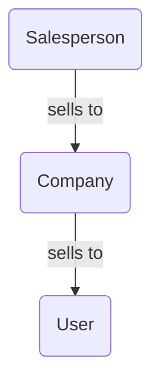
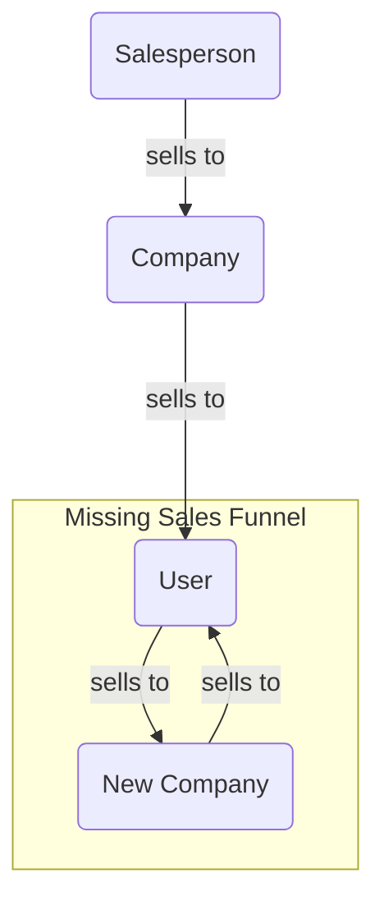

>[!tip] Created: [2022-10-20 Thu 16:22]

>[!question] Targets: [[Tranportable Identity]] [[Unbundled Apps]]

>[!danger] Depends: 

![[DALL·E 2022-10-20 16.47.20 - passports into a small funnel at the top, many more out a large funnel at the bottom.png]]

## Background
[Raytio](https://www.rayt.io) acts as an identity broker so that companies can verify identity properties of clients without being in posession of the full client data.  Companies that share customers can reduce bother to their customers by requiring identity verification only once - with Raytio - decreasing the friction of making a sale.

Raytio currently sells to companies, who then use Raytio when interacting with their customers, but what they could do, is be end customer focused, and push back up the sales process by starting at the customers.  Sort of like lastpass, but for identity relationships with companies.

## Inverting the Sales funnel
Currently, Raytio sells to companies, and companies "sell" Raytio to their customers.  As a customer, I may prefer Raytio to be the identity broker for all companies I interact with, but there is no easy way for an enthusiastic customer to push Raytio onto companies that do not currently use them for identity.

What is lacking is a way for a customer to have their own customer portal, and let them push a link with their profile to a company that wants their identity.  This customer could request the company use Raytio to verify their identity, rather than their current process.  The company, upon opening this link, would be encouraged to sign up for their complimentary portal, and start managing their customers in this way.  

The Business model is that the easy link requires a manual step from the company, and is free for small usage, but after a threshold, clearly they are getting value and should pay.  Many small companies manage their identity services manually, in spreadsheets, and so this introduces them to a better more secure and less manual way.

Any given user has abour two dozen signups with different companies that they need to maintain a profile with, so the incentive to customers is to decrease their burden with each company, with Raytio acting as not only an identity broker, but also a communicaitons broker with all comms going thru Raytio.

### User power
Users should be able to track what companies they have a profile with, and see how those foreign companies have interacted with the link they were sent - give the users total control and visibility of these other companies.  Encourage them to get those companies to use the Raytio platform since it is better for the user and the company.  This feeling of power to the user is a reversal from the current set up, which can deepen the connection between them and the Raytio platform.

Users could model uncooperative companies and keep track of what documents they sent them.  They could use a Raytio generated email address that this company talks with them on, so they know their email address is safe, and they have strong record of what info was sent when.  They can reuse these emails with other companies, and rapidly assemble an identity pack for any new companies they might need to deal with.  Passwords can also be stored in this portal.

Once Raytio have enough users that have modelled a specific uncooperative company, the Raytio sales efforts can target that company specifically, with the weight of their own customer's preferences in hand as solid reasons to promote a valuable switch.  Upon commercialization of a switch, a commission would be paid to users who helped convince this switch.

### Current Sales Flow

### Missing Sales Flow

## Extra Opportunities
1. Protect clients from companies by providing unique email addresses dedicated to a single company.
2. Automatic security integration with smartlocks, or other smart property like escooters
3. Certified document signing - bundle identity verification with online signing of documents
4. Bridging - pay $5 to have Raytio fill out and go thru a verificaiton request at a company on your behalf, with power of attorney or similar
5. Phone proxy service - in all your deailings with a company, Raytio proxies the call and records it, for your private records if required
6. Manage payment processing, like paypal, with unique credit card numbers for each transaction allowing precise cancellation and safety
7. Discovery marketplace of other companies that are Raytio compatible
8. Steganographic prints on passport images
9. Monitor darknet for your images being leaked, so you know to revoke your identities