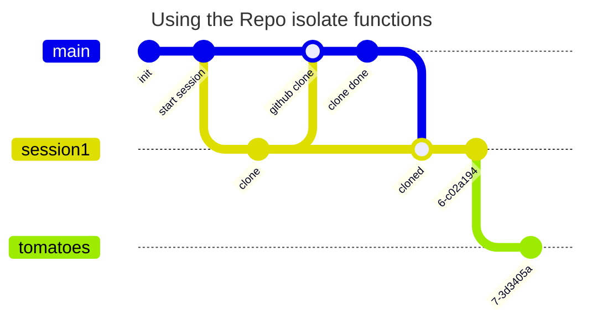
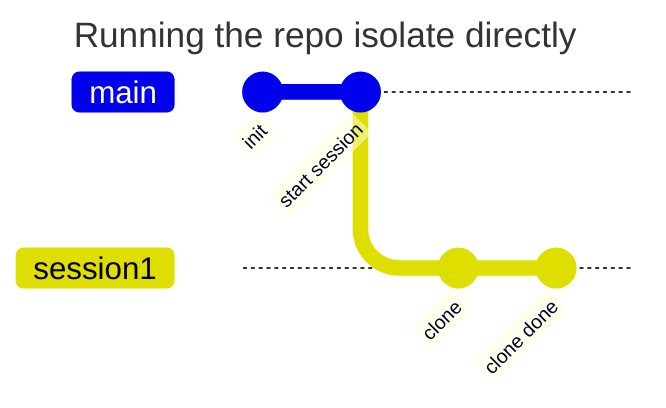

>[!tip] Created: [2024-04-08 Mon 16:17]

>[!question] Targets: 

>[!danger] Depends: 

If instructions to perform repo operations went into a virtualized chain rather than an actual chain ?

But then how would commits work ?

But the repo isolate should be able to run on any chain whatsoever
It effectively splices in git repos into the users account chain.
How do we police when it will have access to the db and now ?
