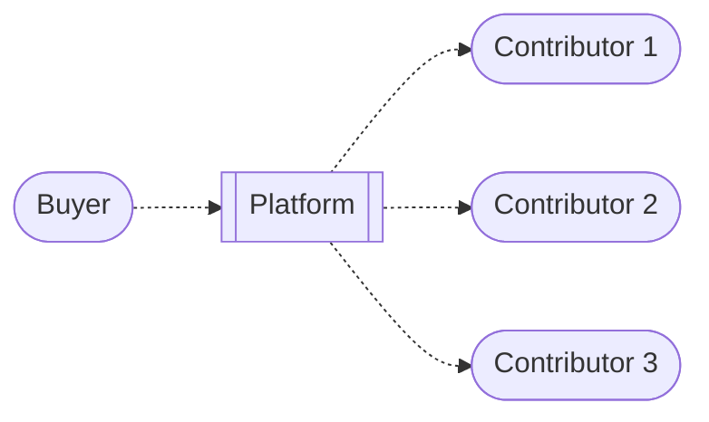
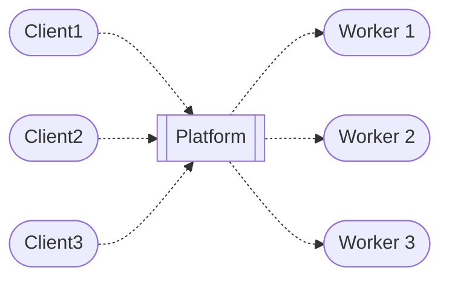
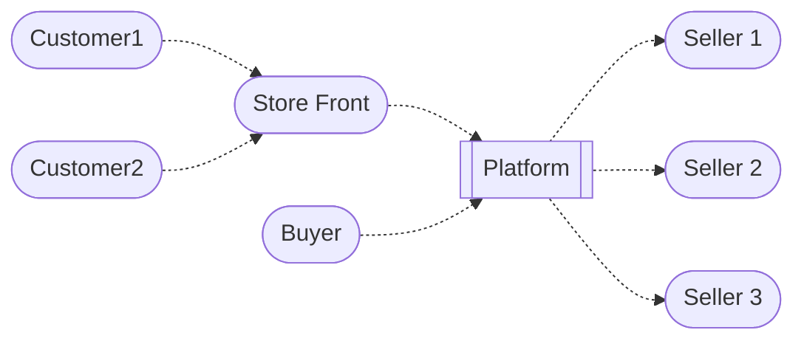

>[!tip] Created: [2024-08-13 Tue 16:37]

>[!question] Targets: 

>[!danger] Depends: 

Buyers paying for usage means that contributors and funders are the suppliers here, and the revenue is split between them.

Several modes
- payment for credits that get consumed by us and the api gateway.
- payment as escrow for services to be delivered, as a funder
- payment as purchasing the use of software, which is then dispersed back to funders and contributors

Payouts can be done in cryptocurrency from stripe.

Might need multiple companies that can act as payment processors for us.

Use stripes id services to kyc the customers.

Could we sell equity in one of these companies ?

Ideally we have a company that holds our NFTs, then list that.

The gateway company is run by us as a not for profit, and merely facilitates commerce.  We want this piece to be able to be done by anyone, and be able to trade between these entities.

What about letting our actors set up shop and charge money to customers directly ?

Basically so long as they are governed by our rules, we should be able to act as their store front ?
Purchasing a service should be just the same as purchasing anything else from us ?
We should manage the currency in the system - like the bank.

If people deposit crypto, then can we pay out in cash by doing an exchange somehow ?
If people deposit in fiat, can we pay out in crypto ?
We could keep these things completely separate, so you can manage both using the platform, but you cannot mix between the two using our payment gateway.

So our gateway issues tokens on chain to represent funds, and those tokens get moved around.  They allow us to track the location, freeze, yank, reverse - everything.
Other gateways can exist, and funds might be exchangeable between them, so long as the kyc and AML information exchanged in an adequate way too.

At the start, we will have two gateways that both use stripe, and we will test moving between them.

The secondary sales of NFTs are banned on stripe, so once you have created an NFT that represents the work that you paid to be done, you can sell it elsewhere on the platform, but those funds cannot mix with your stripe gateway funds.  We would call out that our rules are based on stripe doing the payment processing, and if you want to move your funds to a different gateway, then we can offer services for that.

The NFTs can be sold for crypto, which simply changes the ownership target.  You cannot pay for the sale using the gateway service.  The gateways plug in to the main network, the main network also plugs in to cryptocurrency rails.

If the ownership changes, the stripe payout target changes with it, and any holder can claim previous unclaimed stripe credits for the item they hold - the holder needs to drain the royalties.

Payment flow:
- on the platform, decide it is time to top up
- choose a payment gateway, like crypto, american gateway, some other gateway
- go thru the onboarding flows of them
- deposit funds
- spend with anyone who will take them
- exchange with other members on the platform - exchange for crypto currency is not permitted by stripe gateway funds, but exchange with crypto for crypto is fine

Service providers, like the api gateway, would need to be able to take payment from these gateways.  So the hosting provider entity would take payments from the crypto gateway or the stripe gateway - it doesn't really care.

Identity flow
- some gateways would also offer identity

Selling the ownership of the content seems possibly contentious.
That we sell the consumption using other payment methods as well as stripe seems fine.

You cannot send funds to another user with stripe processed funds.
The allowed transaction types 

We would launch as pure stripe to start with, and then use some resources to make a crypto version separately, then work hard to make sure the merge is seamless.

The holding company, which is not the gateway, might also be the hosting company, which is who we trade as, as individuals,
Set up the gateways with strong articles of incorporation to stop any acquisition ruining the trust.

Part of the service is that the g

Holding co can act as a shield for the creators, so they can work as tho they are members of the holding co, and not draw down funds until later.  Then if the whole system gets acquired, their holdings stay there too.
In these companies, people could change holdings for equity.

We should offer hard coded rules that:
- ensure work done is at market rate, and good quality for the amount of money spent
- ensure that no trading can be done for crypto
- purchasing content ownership vs consuming content

Sell meeting times using AI assisted consultations, so that questions can be asked, and an NFT is made of the event.

Might be easiest to just set up the gateway as also the hosting company at the start ?

The holding company should be able to host the legal entities of people monetising using our platform.  This is independent of the gateway services.  They should be able to set up as a project within our holding company, get phone numbers, physical address, ability to bill directly.  Payments back in to the dreamcatcher would need them to go into the gateway bank account.

Charity gateway would be separate, and would have tight controls on accountability and tracing of where the money went.  It might be done thru the outcome driven gateway, as you want to put money towards something specific happening, or it might be given to someone to manage on your behalf to get the outcome you want.  Returns on these, and reuse, come by way of impact crystals.

First, buy from the hosting services company directly.
Second, buy from the workers on the platform, to get things built
third, buy from works for specific real world services and goods using the platform

One of customers, or holding a balance and paying from that.

But platform usage also includes software usage
There is no difference between purchasing ai credits and purchasing software usage.
? Did you purchase from the platform, or from the suppliers ?
Must have been the platform, since the platform needs to split the payments

Up to a limit where you go flat rate - so set a max spend for usage, and above that you can get greatly decreased pricing.

- gateway used to hold a balance, with auto recharge
- used to pay for compute resources, and software usage, which disperses to contributors
- pay for escrowed software units, then pay out to contributors

Gateway could offer its own cards, so people can access funds instantly, including their credited balance.
Stripe lets us set up treasury, so we could act like their bank account.
Gives them dreamcatcher controls over their spending.

> If dreamcatcher issues cards, then we can allow dreamcatcher to manager a users purchasing from online stores, including tracking delivery, disputing fraudulent purchases.

If you purchase from a dreamcatcher capable store, then the fees are waived, since this is an internal transaction.

Lets workers bill customers directly, and we handle all the admin of payment processing - they can personalised invoices, but we brand it to let people know we are handling the admin.

Lets people purchase things on behalf, like going to the supermarket to collect a bunch of things.

Want to let people connect their stripe account into dreamcatcher directly.  This allows them to take in payments.  Dreamcatcher handles compliance, and liability, if they use the AI governance decision making systems.  So we defend you.

We must launch as promoting ambient attribution, which is the dreamcatcher AI system.

Tracking affiliate rewards when people have caused transactions to occur.

Users could take payments directly, like how shopify does, or they could be purchased from inside the dreamcatcher network.  We would effectively be wrapping stripe functions with an AI layer, and then pick ones that work well to build out more and remove reliance on stripe and increase margins, with maybe some extra features.

Ideally we would be creating an AI marketplace so agents can do shopping for you, rather than these standalone websites.  In creating a store front, you could present AI tooling to the world, and take checkout using stripe payments, but you could also sell direct AI to AI.

You can use our platform to run and manage your business under your own brand, while at the same time listing your service in our online marketplace.  You can additionally offer your services as a whitelabel service.

So we would generate invoices on your behalf, or if you worked for a network entity, that local entity would issue invoices for services rendered, like plumbing.
Set up those entities rapidly and in an automated fashion.

How can the gateway be a peer, too ?
Definitely the hosting provider is a peer.   Content creators are peers in the same way.
The gateway, or some other entity, might need to take responsibility for the work being created, since otherwise we are an escrow service.  If the gateway is responsible for the product being delivered, then the contributors are just suppliers to the gateway entity, like staff.
So we are holding the funds not as escrow, but as prepayment for services to be rendered, then we are responsible for rendering those services.

An exchange, using stripe services for compliance, would be a separate entity in our system.

The gateway needs to be reponsible for the funds, and never passing them thru.  So the credits are issued by the seller.  When software is consumed, you consume it from the gateway.  It pays out to external entities.  It is the hosting company at first, but it just accrues value against it the same way as any other actor on the dreamcatcher can accrue revenue.

The gateway would be the holder of the work NFTs.

Hosting company handles:
- data storage and execution
- identity management and verification
Payment company handles:
- stripe integrations
Escrow company handles
- liability for delivery of solutions

Equity fundraising should be all about the NFT generation.  We can allow people to trade in their NFTs of the things they bought for some shares in the company, and some calculated rate that reflects the amount of money they put in to cause the thing to be made.

Also can pay for the things to be built using shares, so you pay the entity, then we issue stock, then we use those funds, tagged, to be deployed only on specific earmarked tasks, and if that happens, your stock is now held by you.  If we do that 150 times, we have all the shareholders we need.

Make diagrams how buyers can contact an external store front, or purchase internally.  Purchase in the AI powered marketplace. Run thru all use cases and show how this business model handles all that.

Make a series of diagrams representing the business use cases we want to support, which are essentials of the dreamcatcher, and then try fit stripe integration around that.  Not all use cases will be supported must likely, and all will have jurisdictional restrictions.

Escrow functions could be entirely crypto based, and the buying and selling of the NFTs is crypto only, but we pay out usage based on who holds the NFTs, and to collect, you need to set up a connected account.

Need to make the dreamcatcher platform able to support different types of gateway provider, so that a users balance is seen as a unified whole.

Show the payouts going to 3 types: 
- contributors
- funders
- traders - someone who acquired shares in the output 

Can the builders marketplace be separate to the consumables ?
Builders marketplace holds the NFTs, and pays out to them, but the gateway takes in consuming payments, with the builders marketplace being a seller ?

Consumable as the output.
## Test cases
### redlids customers payment handling
Redlids would need to register as a seller.
Then when payments come in, some of that payment goes to the dreamcatcher platform, and is dispersed to the NFT holders.
We would offer AI assisted dispute resolution, and allow connecting other services like debt collection services, which would need to be paid for separately.

The core of the Dreamcatcher is the AI governance system of Ambient Attribution.  This is an LLM powered system that determines 3 things for every consumption transaction on the platform:
- what is the impact of the consumption, in several dimensions, one of which is money ?
- given that impact, what is the price the consumer should pay ?
- given the impact and the consumption, and the contributions to create that impact, what is the attribution due to each contributor ?
This automated decision making is then used to make dispersal payments from the consumers to the contributors.

The second AI governance system used by the platform is the quality assurance system, that determines when 

All other AI system are assistive in nature, not governing.  The choice to conduct business under AI governance is the primary offering the Dreamcatcher makes to all participants.
## Money flow diagrams

There are two types of activity supported in our model, one of consuming software, and the other of constructing software.  Consuming software is presented for purchase either directly on the Dreamcatcher platform, or by 3rd party storefronts, such as a company website that was powered by the Dreamcatcher.

### Software consumption

### Software construction

During software construction activity, clients request work to be done, 

### Storefront sales
