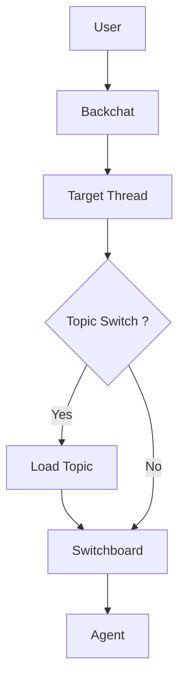

>[!tip] Created: [2024-09-03 Tue 12:23]

>[!question] Targets: 

>[!danger] Depends: 

grouping all the messages about a certain topic into something that can be called up again in the future, rather than a static long thread, it will load up these sections of the thread.

Then navigation takes you back thru the topics.

Topic switching for now can just be a dud, but just show how the reasoning steps work, and how it gets presented back to the user.