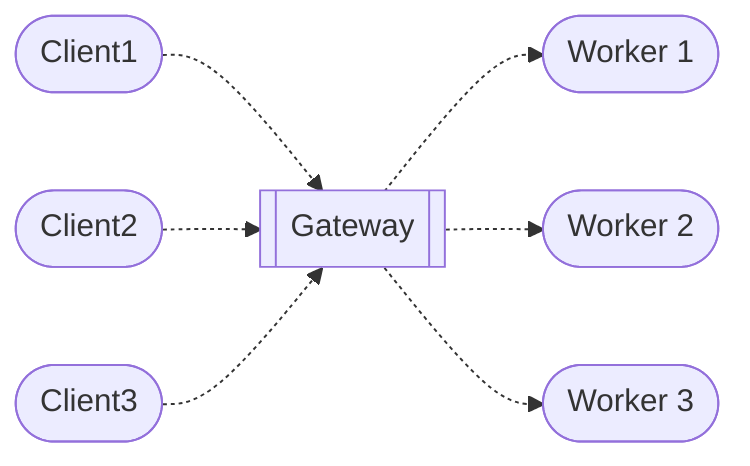

## Dreamcatcher Business Model

The core of the Dreamcatcher is the AI governance system of Ambient Attribution.  This is an LLM powered system that determines 3 things for every consumption transaction on the platform:
- what is the impact of the consumption, in several dimensions, one of which is money ?
- given that impact, what is the price the consumer should pay ?
- given the impact and the consumption, and the contributions to create that impact, what is the attribution due to each contributor ?
This automated decision making is then used to make dispersal payments from the consumers to the contributors.

The second AI governance system used by the platform is the quality assurance system, that determines when work has been completed sufficiently.

All other AI system are assistive in nature, not governing.  The choice to conduct business under AI governance is the primary offering the Dreamcatcher makes to all participants.
## Money flow diagrams

There are two types of activity supported in our model, one of consuming software, and the other of constructing software.  Consuming software is presented for purchase either directly on the Dreamcatcher platform, or by 3rd party storefronts, such as a company website that was powered by the Dreamcatcher.

The gateway operates as a non profit entity, for the benefit of the ecosystem, to allow members to trade.  It must not be owned, as it can choke the growth of the network.
### Software consumption
This is the revenue stream of the Dreamcatcher - consumption of software that is assembled just in time with attribution paid to all who contributed, fairly split by an AI governance mechanism.

### Software construction

During software construction activity, clients request work to be done from the platform, and once the QA requirements have been met, the funds are dispersed to the workers, in proportion to their work.

Flattening AIs, where the conversion of assets has an impact as to how many funding tokens they get in the end.

### Storefront sales
Sometimes customers are better served by another entity providing them with a store front, rather than consume the software thru the Dreamcatcher directly.  Here a billing relationship is passed thru to the gateway, allowing a more tailored customer experience, with the customers possibly unaware they are interacting with the Dreamcatcher:

### Trading license shares)
Here when someone holds license shares that another person wants they can sell them in a bids and asks market, and now the new owner is the one who receives the royalties for the consumption of the software the license represents.

## Investment vehicle
To ensure fair treatment of all, the platform cannot be owned by any single entity.  This structure is affirmed by permitting more than one gateway to operate harmoniously.  The way to raise capital in this system is use the software construction model, but by way of an investment vehicle.  This avoids raising capital into the gateway directly, removing the temptation to corrupt the network for short term gains.

This investment vehicle would sell equity for capital, and would use that capital to act as a client for work to be done, as shown here:

Once the work was completed, then the company would hold contributor licenses, which entitle the entity to revenue streams on usage:

The company may also spend that capital on acquiring license shares from those willing to trade, and would engage in promotional activities and business development to increase the value of the license shares it holds:

The primary category of license shares it seeks are those that are core parts of the Dreamcatcher, as those will be the attributed to, so far as we can see.  The company valuation should largely be due to the market value of the license shares it holds, which is based on the revenue it is earning, and it can periodically transfer those licenses to shareholders as a dividend, or sell some off to raise further capital:

