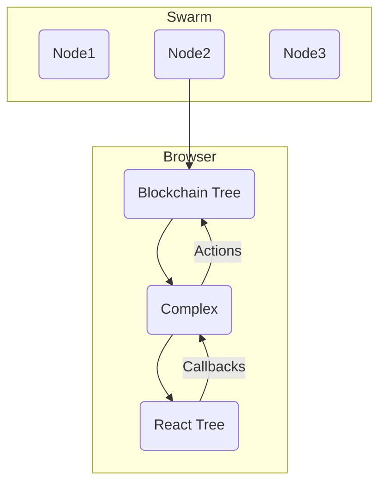
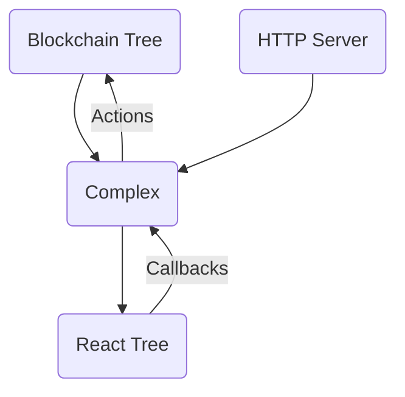

The prop passed down to all React children that holds a static snapshot of the chainstate.  The primary benefit is decoupling the blockchain datasource from the presentation layer, enabling componentized development, particularly using [Storybook](https://storybook.js.org/). 

The Complex presents its data as an instantaneous snapshot suitable for any [reactive paradigms](https://en.wikipedia.org/wiki/Reactive_programming) and offers a standard interface for indicating that tree shaped data is still loading, while allowing for cache eviction when the snapshot data becomes large.

## Splicing of data sources
The Complex provides a standard interface for providing tree based blockchain formatted data into a React tree of UI components.  It seems easy to give the Complex interfaces to other data sources such as http requests and posts, which can allow it to be independent of the blockchain backend.  

This can make the integrated presentation of hybrid GUI systems that have both blockchain and legacy http much simpler, allowing for gradual migration of the backend.  Also switching risk between UI