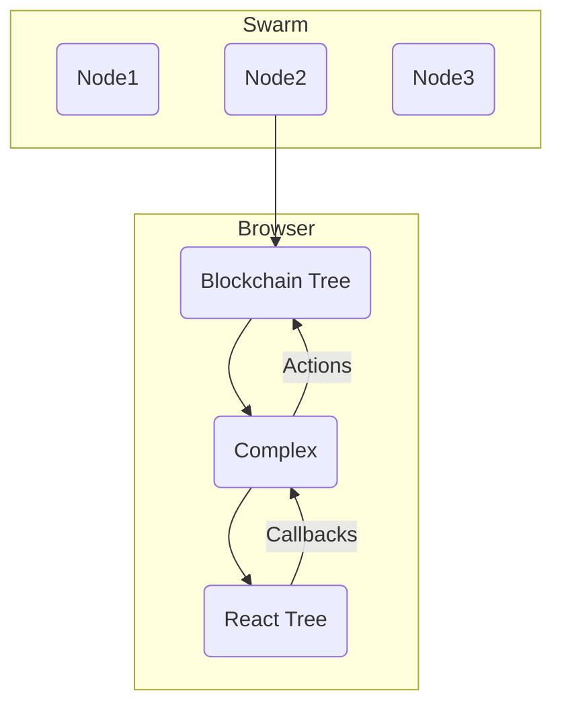
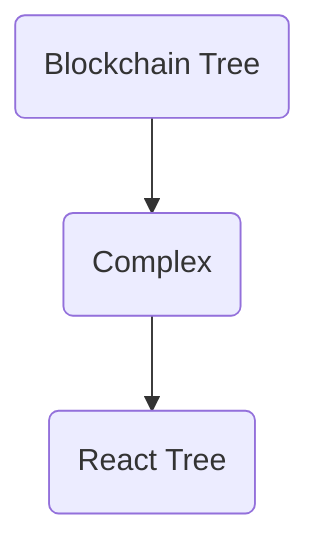

The prop passed down to all React children that holds a static snapshot of the chainstate.

```mermaid
graph TD
	subgraph Swarm
		N1(Node1)
		N2(Node2)
		N3(Node3)		
	end
	subgraph Browser
		N2 --> B
		B(Blockchain Tree) --> C(Complex)
		C --> R(React Tree)
		C -->|Actions| B
		R -->|Callbacks| C 
	end
```

## Splicing of data sources

```mermaid
graph TD
	B(Blockchain Tree) --> C(Complex)
	C --> R(React Tree)
```