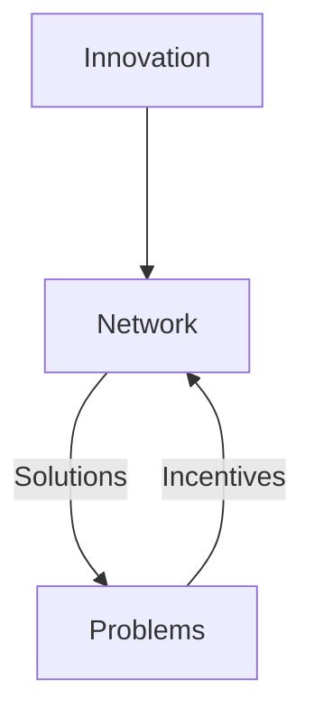
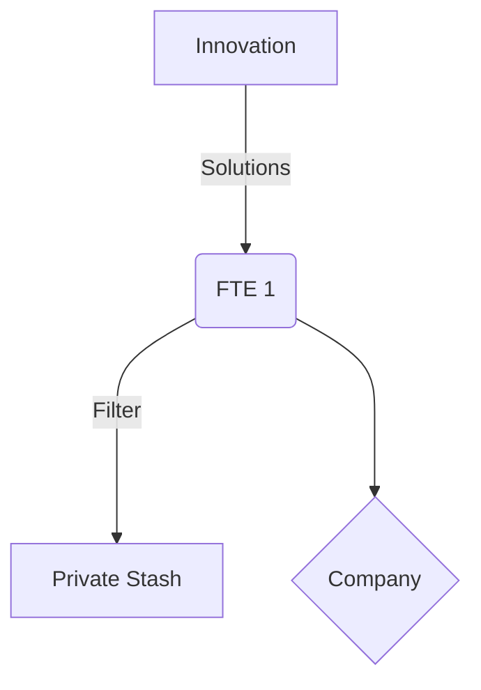
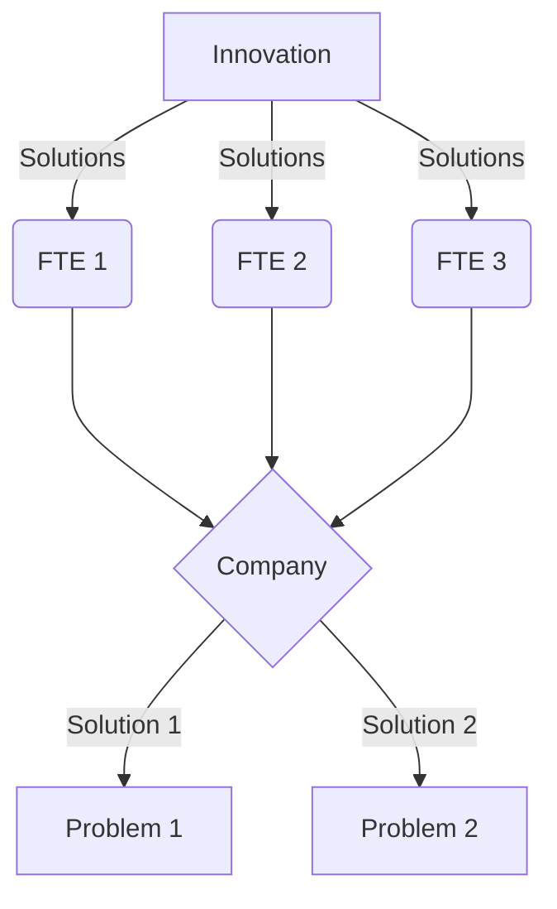

The internet was born of packet switching over transmission lines, taken to its maximum conclusion, which is limitless scale.  Obviously ipv4 had some limits, but the concept scales without limit, whereas any implementation has to make tradeoffs with the available technology.

In this model, various organizational structures are modelled by their network topologies, and their performance in transmitting from source to target is compared.

The goal of this model is to be able to compare the topology of one arrangement with another in terms of innovation efficiency, which is how much innovation can reach the problems and what is the relative cost, and how long.  How long in this model means how many transmission hops were required.

Innovation is modelled as an infinite source of zero cost and of unknown origin, that is transmitted through a network of people who are connected together in varying topologies with various transmission properties modelled by groups of components.  The only limit on the rate of innovation flowing from the source is the transmission network thru which it flows.  Innovation comes out in discrete packets.  We are not concerned what is inside them, we are only concerned with how they got to the destination problems.

Incentives are modelled as proportions to innovation received.  Incentives are consumed entirely by the transmission network, as the Innovation source requires no fuel in this model. At the highest level, the model is:

## Components
### Incentives
Varying costs are accrued for each component of the network.  Incentives are released by problems back to the network, and depending on how the network is configured, different amounts reach the network components.  If no incentive reaches a component, it will never operate again.  This can be used to capture a startup venture that receives some funding to try get a particular part of the network operating sustainably, but fails to do so, and so all the stored incentive is lost.

Incentives can only have come from solved problems, and a sustainable network configuration is able to continue indefinitely.

### People as Transmission lines
These are transmission circuits in the network model.  They have a fixed maximum capacity.  For the purposes of this model, innovation is something that flows through people, rather than something people create.

The source of communications on this network is Innovation.  The destination is Problems.  The path that solutions travel on from Innovation to Problem is unknowable ahead of time.

Any transmission line can also act as an antenna, and receive new innovation from the source.
### Full time employees (FTEs)
These are a dedicated circuit that only serves the traffic of its owner.

The FTE transmission line includes a filter where the best ideas are redirected elsewhere sometimes.

### Switch
Any place where people coordinate with each other necessitates a switch component to change packets between transmission lines.  In its purest form, this is a fair market.  The switch function takes a damping parameter, that describes restrictions on the switch.  The purest switch has the potential to connect with any person.

This relates to the selection of ideas too, where the quality of the ideas can be related to the number of people it was open to, as well as the incentives to solve it.  So with more switch options, the greater the quality output.

If ideas are measured as random injections into a transmission line, and the rest is methodical processing, then we can show how the speed and quality are affected by varying arrangements of components.  An equation can be formulated to show these outputs with varying parameters like money, time, people, incentive connections.

Switching cost is an important factor, as a manual switch consumes standby costs and operating costs and is very slow so has a low switching rate, but an AI switch is very fast and cheap, with perhaps some quality tradeoffs.
### Contractors
There are circuits that are temporarily dedicated to the traffic of its owner, but can switch between owners more rapidly than FTEs.  They can also multiplex, and serve transmissions of several owners simultaneously
### Freelancers
This transmission line can switch rapidly between packets, serving whichever owners are most conveninent at the time, and responding to changes in source and target pressure
### Companies
This network component controls multiple transmission lines, and presents a virtual transmission line to its customers.

Companies act as a forced router, where traffic must pass through.  They are also selective, and will reject some transmissions if it does not serve them directly.

These components also modify the solution components, and combine them with each other - very rarely does a solution make it all the way through the org with fidelity.  It also strives to provide the same solution to multiple people.

### Packet loss
This component receives innovation but destroys them upon receipt.  The loss may be partial, and per part of a packet, or randomly be the full packet.  This is a non deterministic process.  

### Innovation Buffers
These components can store up innovation for an arbitrary time before continuing transmission.  A Buffer has a decay function built in, as innovation does not store well.  Innovation degrades over time as well as the whole circuit being wasted if another part of the network solves the problem sooner, meaning that all the incentives spent in this portion of the circuit are wasted.

These decay linearly over time, with some randomization.

This component helps to model the cost of delay.
### Incentive Buffers
Incentive buffers decay negligibly over time.  These are equivalent to bank accounts.  When they are accumulated, then they can be redirected to change the shape of the network and grow parts that are previously starved.
### Connection Broker
A common component in Innovation networks is a switch that brokers connections before allowing innovation to flow.  This component is seen in [[Upwork Model|Upwork]], and represents the portion of their model that requires [[Funders]] and [[Do-ers]] to negotiate with each other before Innovation can be attempted.  This places extra load on both transmission lines which is the price of making a connection, and to change this connection once made is the cost of switching.
## Effects
### Backpressure
When the target cannot receive all the solutions being pushed to it
### No route to host
When Innovation is available, but cannot find a path to the Problem.  A special case of this is when losses would be so high that whilst the path logically exists, nothing can feasibly flow down it

## Scenarios
### Company chokes
Show that because the company component chokes maximum thruput, they can block themselves from achieving a higher thruput just by way of configuration.  They seek a local maximum thruput at the expense of global thruput.  This model should be able to show how their local maximum is higher if they pursue global maximum.

### Management Chokes
Show how having layers of management ruins network performance even more

### Upwork
Upwork has a permissioned gateway component that requires transmitter and received to agree to the terms of transmission before transmission can occur.  The gateway also guarantees exclusivity of transmission, for the purposes of exclusivity of incentive.  As the number of bidders gets large, this gateway delay causes significant backpressure and an unsatisfactory level of service to both transmitters and receivers due to the overhead of permissioned negotiation.

We can show that the cost of this gateway negotiation drains the incentive buffer of both transmitter and receivers in ways that can cause the negotiation to fail because it ran out of energy.  This overhead is not strictly in money, but in time, which can be far more costly to either party, and it always requires double coincidence of onlineness.

## Things to model but unsure how
### Patents
These represent some artificial control over a particular frequence of the innovation network.  Need to be able to illustrate how patents can block problems getting the ideal solution, since extra innovation was required to go around some patents, and the usage is not fairly governed, so the innovation rate remains suboptimal.