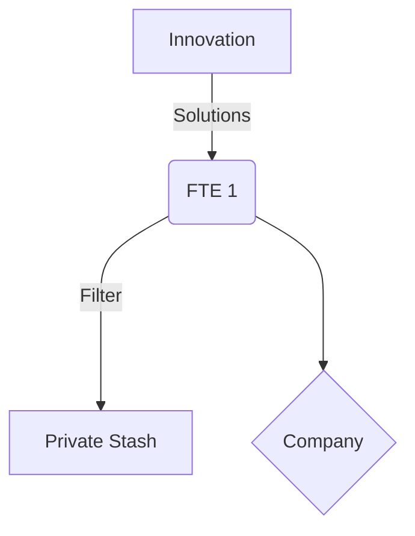
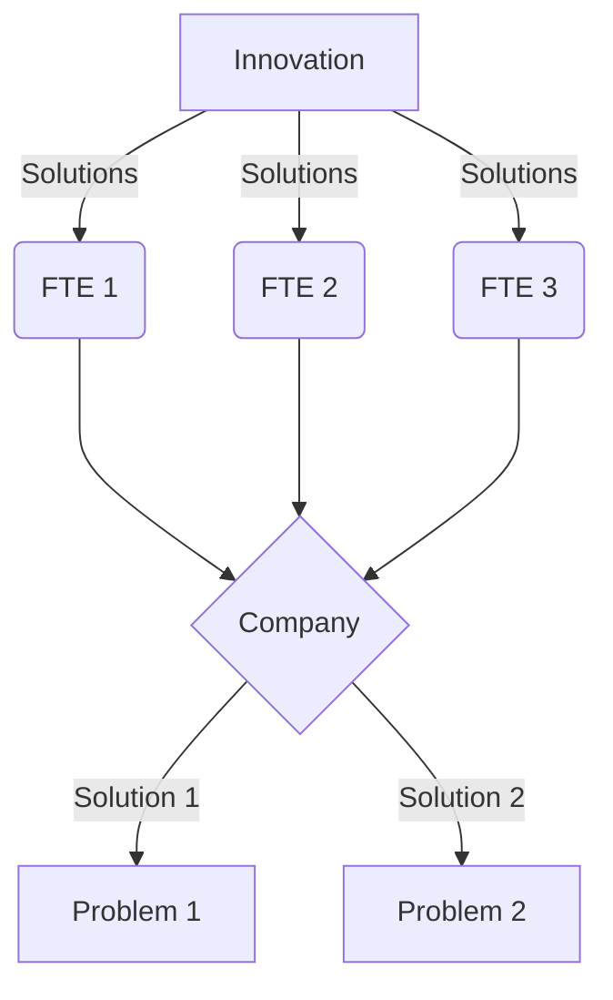

The internet was born of packet switching over transmission lines, taking to its maximum conclusion, which is limitless scale.  Obviously ipv4 had some limits, but the concept scales without limit, whereas any implementation has to make tradeoffs with the available technology.

In this model, various organizational structures are modelled by their network topologies, and their performance in transmitting from source to target is compared.

## Components
### People
These are transmission circuits in the network model.  They have a fixed maximum capacity.  For the purposes of this model, innovation is something that flows through people, rather than something people create.

The source of communications on this network is Innovation.  The destination is Problems.  The path that solutions travel on from Innovation to Problem is unknowable ahead of time.

### Full time employees (FTEs)
These are a dedicated circuit that only serves the traffic of its owner.

The FTE transmission line includes a filter where the best ideas are redirected elsewhere sometimes.

### Contractors
There are circuits that are temporarily dedicated to the traffic of its owner, but can switch between owners more rapidly than FTEs.  They can also multiplex, and serve transmissions of several owners simultaneously
### Freelancers
This transmission line can switch rapidly between packets, serving whichever owners are most conveninent at the time, and responding to changes in source and target pressure

### Companies
This network component controls multiple transmission lines, and presents a virtual transmission line to its customers.

Companies act as a forced router, where traffic must pass through.  They are also selective, and will reject some transmissions if it does not serve them directly.

These components also modify the solution components, and combine them with each other - very rarely does a solution make it all the way through the org with fidelity.  It also strives to provide the same solution to multiple people.
## Effects
### Backpressure
When the target cannot receive all the solutions being pushed to it
## Scenarios
### Company chokes
Show that because the company component chokes maximum thruput, they can block themselves from achieving a higher thruput themselves.  They seek a local maximum thruput at the expense of global thruput.  This model should be able to show how their local maximum is higher if they pursue global maximum.

### Management Chokes
Show how having layers of management ruins network performance even more
## Problems
1. What is the source of innovation in the model ?  Transmission lines are neither sources nor sinks