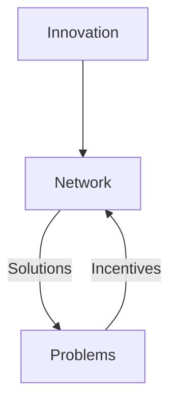
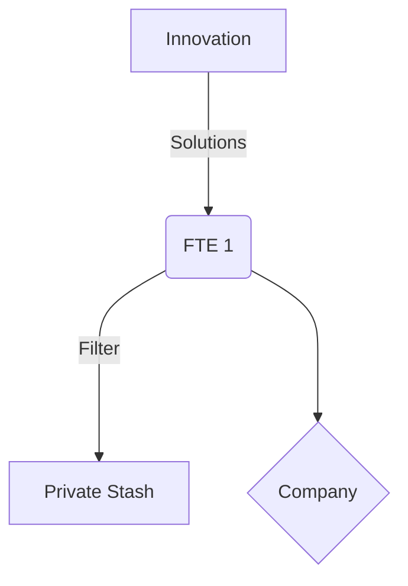
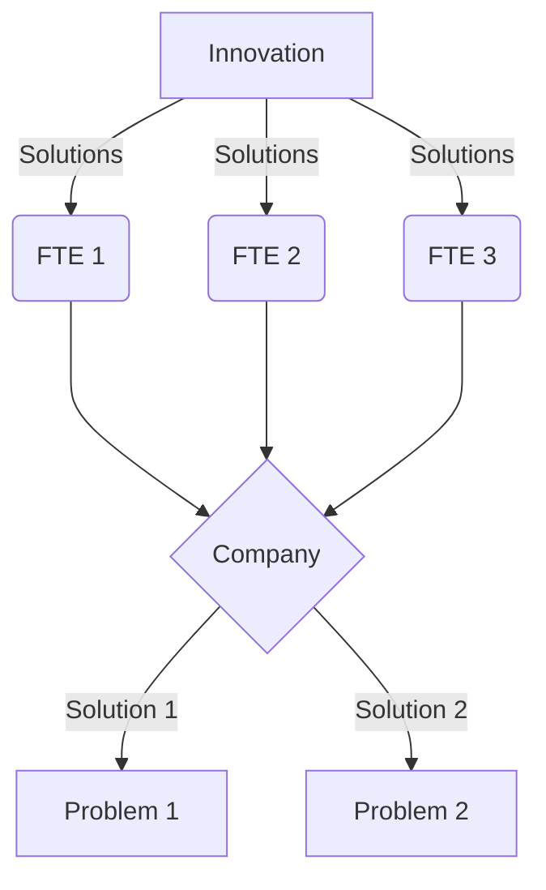

The internet was born of packet switching over transmission lines, taken to its maximum conclusion, which is limitless scale.  Obviously ipv4 had some limits, but the concept scales without limit, whereas any implementation has to make tradeoffs with the available technology.

In this model, various organizational structures are modelled by their network topologies, and their performance in transmitting from source to target is compared.

Innovation is modelled as an infinite source of zero cost and of unknown origin, that is transmitted through a newtork of people who are connected together in varying topologies with various transmission properties modelled by groups of components.  The only limit on the rate of innovation flowing from the source is the transmission network thru which it flows.

Incentives are modelled as always in proportion to innovation received.  Incentives are consumed entirely by the transmission network, as the Innovation source requires no fuel in this model. At the highest level, the model is:

## Components
### People as Transmission lines
These are transmission circuits in the network model.  They have a fixed maximum capacity.  For the purposes of this model, innovation is something that flows through people, rather than something people create.

The source of communications on this network is Innovation.  The destination is Problems.  The path that solutions travel on from Innovation to Problem is unknowable ahead of time.

Any transmission line can also act as an antenna, and receive new innovation from the source.
### Full time employees (FTEs)
These are a dedicated circuit that only serves the traffic of its owner.

The FTE transmission line includes a filter where the best ideas are redirected elsewhere sometimes.

### Switch
Any place where people coordinate with each other necessitates a switch change packets between transmission lines
### Contractors
There are circuits that are temporarily dedicated to the traffic of its owner, but can switch between owners more rapidly than FTEs.  They can also multiplex, and serve transmissions of several owners simultaneously
### Freelancers
This transmission line can switch rapidly between packets, serving whichever owners are most conveninent at the time, and responding to changes in source and target pressure

### Companies
This network component controls multiple transmission lines, and presents a virtual transmission line to its customers.

Companies act as a forced router, where traffic must pass through.  They are also selective, and will reject some transmissions if it does not serve them directly.

These components also modify the solution components, and combine them with each other - very rarely does a solution make it all the way through the org with fidelity.  It also strives to provide the same solution to multiple people.
### Packet loss
This component receives innovation but destroys them upon receipt.  The loss may be partial, and per part of a packet, or randomly be the full packet.
### Buffers
These components can store up innovation
## Effects
### Backpressure
When the target cannot receive all the solutions being pushed to it
### No route to host
When Innovation is available, but cannot find a path to the Problem.  A special case of this is when losses would be so high that whilst the path logically exists, nothing can feasibly flow down it

## Scenarios
### Company chokes
Show that because the company component chokes maximum thruput, they can block themselves from achieving a higher thruput themselves.  They seek a local maximum thruput at the expense of global thruput.  This model should be able to show how their local maximum is higher if they pursue global maximum.

### Management Chokes
Show how having layers of management ruins network performance even more
