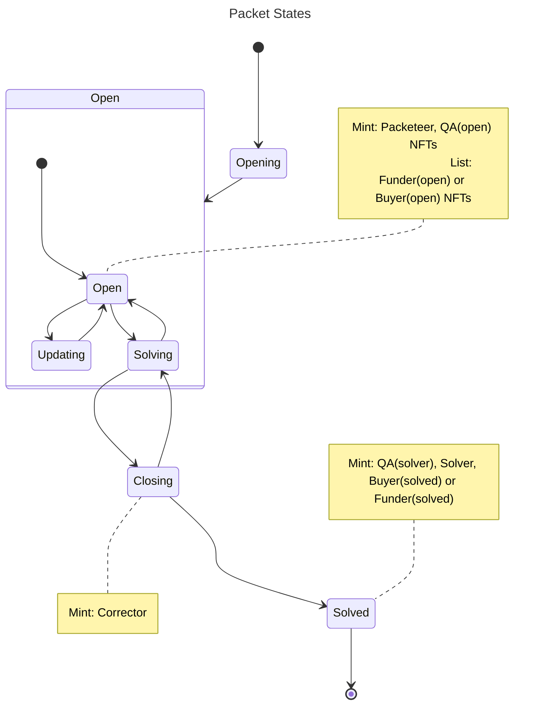
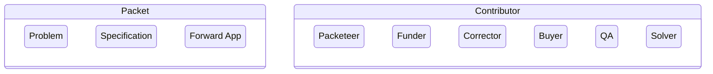

>[!tip] Created: [2023-05-15 Mon 18:34]

>[!question] Targets: 

>[!danger] Depends: 

Fundamentally we are using Ethereum as the payment processor, security / identity layer, and Escrow agent, whilst enforcing participation in packets to guard against securities.  

The purpose of the contract is to store contribution events reliably, while managing usable funds.  Attribution is calculated afterwards.  Decentralized Attribution is the first system we seek to make, made up of a public chain, attribution trackers, packet improvements.  Any rewards to contributors to the Ambient Attribution system can only come thru that completed system, and worse, only when decentralized payment is being made into it.  But the benefit, is that every ambient attribution payment will intrinsically attribute to the packets that made it.

Are you decentralized if you run on an autonomous contract on Ethereum ?

Can we be targetted as a 3rd party if any returns rely on us to make ambient attribution ? Possibly, so we are vulnerable while AA does not exist.  It needs AA + decentralized returns, so it isn't solely us, altho without us it doesn't happen.  But, the project being open and with other participants, others could carry on, so we are replaceable.  If we died, the project can still continue without us.

The consideration of the funds release is the software code being produced, and the artwork.

Could split the contracts, so appears separate on opensea.  All funders in one contract, QAs in another - else a jumble will show up in opensea.

Dust proposals without enough fees are handled by

Disputes can use the same logic repeatedly of a group, a proposalId, and some new thing to be considered.

Currently Do-ers must receive the full amount from the funders.
QAs may need to stake something to keep their badge.

A Packet can be for a Problem, a Spec, or an App.
Packets can only be closed by a Solution.
Solutions are the destinations of the packets.

Contract operations are:
1. Packetize a Problem
2. list an Idea
3. submit a solution
4. purchase an app
5. forwards purchase an app
6. fund a Request
7. fund an Idea
8. 

## Functions DreamEther Contract

### `setAutonomous()`
Revokes all controls from the contract.

### `setAttributor( address )`
Sets the contract address that manages the withdrawl of funds accumulated from buying activity.

### `withdraw( proof )`
Provide the hash of the latest ambient attribution system that includes a calculation of how much your specific address should receive.

### addModerator( address )
Adds the moderator at the bottom of the stack.
### revokeModerator( address )
Only a higher moderator can revoke a lower moderator
### swapModerator( toAddress )
Moderator replacing their address with another one of the same power.  Maintains the same position in the moderator queue.  Used by moderators to cycle their addresses.

### `addQA( address )`

### revokeQA( address )

### `setQAMinFee( int )`
This fee is bluntly set initially.  This might get calculated based on what proposals are not getting processed by QA, so we can get a sense of what the floor of the service is - avoids having lots of spam proposals.  Higher fees would mean your proposal got reviewed quicker, but 

### `propose( pulseId )`
Propose with a specific pulseId.  Must include the QA fees, which forms a marketplace.

### `fundProposal( proposalId )`
Send ETH to speed up a proposal in the QA queue, to allow multiple people to fund the proposals.  There is no NFT minted for this.

### `proposeUpdate( proposalId, dataHash )`
Propose any changes to an existing packet, such as artwork changes.  Must include fees in ETH.  

### `proposeMerge( fromProposalId, toProposalId )`
If the merge is passed by QA, then 

### `proposeClose( proposalId, fundsClaim, dataHash )`
Loads up the proposal with the fees and a dreamcatcher link to the data related to the closure of the proposal.  This will be reviewed by QA, and a feedback loop offchain established.  Once accepted by QA, then the packet will be closed.

### `disputeDoerSplit( proposalId, dataHash )`
Provide a Dreamcatcher link with your view of how the split should go.  The do-er split is important as it disperses funds.

### `disputeClose( proposalId, dataHash )`
Any body anywhere can dispute the close.  They need to provide a QA fee

### `vetoQA( proposalId )`
Another QA can veto any other QAs.

### revokePropose( proposalId )
Can be done by the proposer or by the contract moderator.  Will cause all fees to be refunded.

## Functions on Packet Contract

## Objects

### Packet
This is never tradeable as it stays owned by the DreamEther contract.  All the NFTs that are derived from it are tradeable.  In one of two states: open or closed.  Open means active work is able to take place in order to receive the rewards for the packet.  Closed means that work was accepted, so no more funding is required.  Can still purchase funding NFTs, but these might get rejected by the holders.  Packet can go open again if a proposal for improving it opens up.  If that happens, any unclaimed closed funds will be available to the open packet.

This is not strictly a token, but rather a token factory.

## Token Types in ERC1155
Idea is that in OpenSea we should up as a single verified contract, and then have one tokenId per packet, and one tokenId for each other NFT type, all of which are tradeable.  OpenSea listing is desirable due to the familiarity of use, the traffic available.  Token types are:

### Funder
This NFT derives its metadata from the Packet that owns it.  Funder tokens are listed on OpenSea for sale in various denominations: 10 x 1,000, 10 x 10,000, 10 x 100.  This lets you fund with any amount you want.  Each time a purchase occurs, the listing is replenished.  DAI is used since the Packet needs to hold funds for a months at a time, so it needs to be stable.  Whenever someone buys any amount, the DAI goes into the Packet for management.  Buying on OpenSea adds the selling fees on, so if you purchase directly from the DreamEther contract, it will be at a discount.

If the funder removes their funding, they are triggering a token burn, which returns funds to them and destroys the token.

### Do-er 
These are minted with a trait from 1 to 100, each one representing a percentage contribution based on the QA view of how submitted proposals contributed to the final outcome.  The judgement is disputable, and requires another QA to close it.  Each dispute costs ETH, and you can dispute up to 10 times.  This can take into account plaigiarism, where QA thinks you took someone elses work online, and tried to claim funds for it.  They can refund some portion of the funds allocated to each one within the next 5 days.

### Qualiteer
One is minted to each QA that took part in the packet.  The QAs never receive any cut of the funding, so they are not incentivized to pass substandard work.  Traits indicate the work each one did, with the traits being set by the highest QA that closed the packet.  A specific QA can only be applied on solve.

Traits spec what type of QA you did - if you were specifically required by the packeteers, then your trait says as much.  Trait is for opening or solving.

### Buyer
Purchasing the usage of a product.  Can purchase a Forward App where the App does not yet exist.
Purchasing from the store will pool the money which will be dispersed using DRE.

### App
An app is a wrapper around an Idea that is meant for end consumption.

### Packeteer
Whenever QA passes a packet that you submitted, you are minted this NFT.  Each one has a trait from 1 to 100 indicating the percentage input the granting QA thinks you had to this packet.  You can trade these on OpenSea - they carry no power or funding.  A role trait says if you were funding, doing, or QA.

### Corrector 
If you dispute something with the QA and win, this is your prize.
