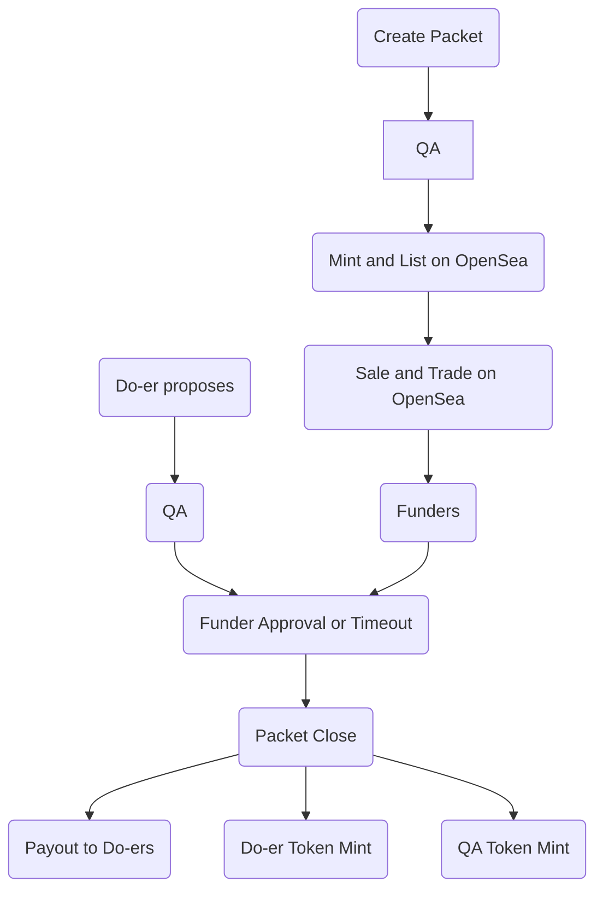

>[!tip] Created: [2023-04-06 Thu 14:14]

>[!question] Targets: 

>[!danger] Depends: 

Is it actually possible to make a version of the Dreamcatcher that uses Ethereum as the base blockchain ?

Securities are a bad thing in web3 since they allow investors to be scammed because the detach investors from their money at worst, and at best make insider trading possible.  The SEC has made clear and well tested ruling as to what constitutes a security by way of the Howey Test.  All web3 projects should exceed the spirit of the Howey Test, and not merely pass it.

Is it still a security if what is being bought is ownership of the code ?
What is being purchased is the right to license the open source code as your own license ?
If revenue comes in for this component, then it goes back to the funders ?  But this part could be a security ?

A distributed enterprise.  No one party is responsible for profits.

To pass, you must participate.  That is, use the code produced somehow, in some meaningful way, like deploy the instance and use it regularly, sell usage to someone, write the code / check it / scrutinize it.

Is it enough that you are required to accept the code as complete, as this is participation ?  You have the control to reject the code - timeout to comply passes to QA arbitrator.  Whilst you can nominate an independent QA to do your assessments, this power is always yours, you have the final say, the QA is not related to the workers, you can switch out the QA.

If we gave you final say, and made dispute / timeout different to QA, then is it not a security because you have final say whether the money goes in or not ?  QA can be called upon if you block or refuse to acknowedge completion ?

Should be enough that you COULD dispute the QA outcome, and that there is a time period for you to do so, which means you have reasonable control over the project, since you can choose what items money is spent on, and you can dispute that the work was done satisfactorily.

So as long as participation thru ability to reject work, to select from a range of work options, and to demonstrate competency by way of some test to know what code is being looked at, we can take on funding that feels like investment, but is not.

## Subcontractor companies
The Dreamcatcher acts like a rulesetter in between us (a contracting company) and them (funders of software) - it ensures that both sides are honest and open, and maintains freedom of maneouvre for all.  Purchased usage of the software needs to go thru the Dreamcatcher too

## Howey Test
1.  An investment of money
2.  In a common enterprise
3.  A reasonable expectation of profit
4.  Derived from the efforts of others

Or we could just register as an issue in the USA ?  Or in Canada ?

Selling a license to use a particular software, and then offering a cut of future earnings provided you demonstrate actual usage means that it wasn't purchased primarily for the profit aspect.  Setting up your own bot to try fake usage is also not our fault.  Using the public blockchain where credits must be paid as a way to ensure it is legit usage, since it would cost you every time, can guarantee that it is not a security.

Easiest way by far is to be actual registered securities.

## Prepaid services
If people invest by prepayment for access to services, and those commitments also grant attribution by a system that is by definition decentralized, then the investment could not be a security.  If the investment was purely for the attribution, then it would be a security unless you participate in the packet.

We can identify non participation, whereby others can vote that your contribution was not valuable, you haven't processed any issues, you haven't voted on anything you were asked to - if all you did was select the packets you want processed, then you get blocked until you re-participate.

## NFT fundraising
Sell an NFT that represents a request for something.  Puchasing it puts the funds into the NFT wallet being held by smart contract.  When the parent token is transferred to the winner(s), the funds move with it.  Never say that a financial benefit will be returned.  "The ambient attribution system will be forever grateful".  Those who want to see the packet completed could fund its completion by offering prize money, or commiting to prepay service tokens that it will generate.

There is no reward for offering this prize, other than the indelible record of your contribution towards building a universal ambient attribution system.  Then have links to how that system works.

This is a way of blind funding - it is a security except that it offers no reward.  You really need to know whats going on to be able to see investment returns ever coming from this.

If a HK company sold and produced the NFTs, or they were produced anonymously, can avoid being sued ?

## NFT Packet Participation
Purchase on OpenSea, for a Request or an Idea, and you get minted a funding NFT.  In order to release the funds you locked into this NFT, you must make either a release() call, or the QA makes a release call, and the timeout occurs.  Purchasing the NFT bonds to a task definition, which can be changed by QA and timeout, but never materially, and bonds to release of funds by the governing NFT based on QA, or by timeout.  In the traits you can set a timeout for your funds to be returned back to you.  Purchasing the NFT forms a prize pool that is awarded to those who make the embodied state change occur, as decided by independent QA, and vetoable by the partcipants.

The NFTs can be traded around any way you like.  The high value of worthless NFTs indicates the NFT itself holds the value, without the promise of reward.  The NFT holds the veto rights, and cannot be transferred with outstanding veto occuring. 

Pre completion, trading gives you participation rights and possible refund rights.  Post completion, NFT gives you contribution recognition, like a commemorative event, possibly rights to mint a new license for the produced software, and ambient attribution, which is the decentralized attribution system.  By being decentralized by definition, there can be no single party responsible for the reward.  So the NFT thruout its whole lifecycle has this security like ROI from a purposefully decentralized mechanism that is being built by all the other people who participated in the NFTs, and so post completion it becomes tradeable as spec

We would provide a tool that can forcast the decentralized attribution to the NFT participants.  This tool would start with ETH but them would move to DRE native, and bridge other chains and data sources, like github and the linux mailing lists.  All the language around AA needs to be decentralized.  Bonding to an already decentralized project like SI can give it decentralized nexus immediately.

Purchases can be immediately traded into DAI using uniswap, to give stability to the money.  Or a [[spread stablecoin]] can be used.

Inversion of the DAO.  Each task has a DAO formed around it, making the governance more swarm like.

Automatic production of a map that shows how this packet relates to others.
Independent tooling that can calculate attribution that would flow from a universal attribution system, based on current forecast demand.  The calculator only works for decentralized demand, since this is the only it cannot be a security.

Please give us a decentralized attribution system, that our business models may be that of pure service, and the price is set automatically by intelligence higher and fairer than us.

Paying Nigerian tech workers in crypto would be easier for them than thru the traditional banking system.  We would be using ETH as a way for people to feel safe about their funds, and to avoid the banking discipline required to do this manually - more control to participants, less admin for us - seems to win all round.  ETH fees are still cheaper than bank fees and at least ETH has finality, whereas banking system does not.

The big events go onchain in ETH, like bank transfers and funding intake / disbursement.
AA operates on the Dreamcatcher only, since it can process micro payments effectively.

Make eth contract review be packetized, so that reputation of the reviewer is also stored on chain.

Idea definitions can go thru QA to get some assurance that they do indeed meet a proposed Request, at least according to that QA.

Packets can propose they are part of any other project, and will need to be accepted by that projects QA to be included.

Copyright of the image is transferred with the NFT, meaning its usage can be controlled using takedowns.

Packets can be set up to create other packets.

### Process
1. Create task definition in Dreamcatcher web tool, which makes a DRE chain and generates images and data.
2. Select QA, link to target / parent projects, and propose for minting with ETH mint fees
3. QA feedback concludes, and Request or Idea packet is minted onto OpenSea using the Dreamcatcher Deployer.  DNS naming is used to provide heirarchy eg: Project1.Project2.Project3
4. Alice purchases $100 worth of the NFT in DAI on OpenSea, and is minted a funder token with traits holding the amount in DAI and the timeout period where she is refunded.
5. Alice trades this NFT on OpenSea to Bob before completion for $50 as she no longer thinks the endeavour is worthwhile and wants at least some cash back.
6. A Do-er submits a proposal to QA that they have completed the packet, which includes their ETH fee for processing and the QA fee for review.
7. QA accepts the proposal, and marks the packet NFT to payout, possibly with splits to prior contributors, to encourage building on prior attempts.
8. Packet NFT goes into pending mode, suspending contributor trading unless accept() or reject() has been called on the contributor NFT.
9. Once timeout has passed and no disputes have been entered into, the NFT Packet mints Do-er tokens to all the contributors, and disperses the funds of the Packet NFT to those tokens as apportioned by the QA.  The NFT packet becomes inert, remaining as a lasting record of the coordinated effort used to turn it into a reality.  QA is minted QA contributor tokens for a successful close.  Each contributor token as a claim() function to pull funds out - a token that was left untouched is more valuable than one that was drained.  Its traits hold its balance, so hopefully opensea can stop sales if the trait changes because the NFT was sold.  Can also make it unwithdrawable if some other contract has control over it, ie: it has been listed with opensea.
10. All NFTs can now be traded openly on OpenSea, with the value being the intrinsic value of the token + artwork + rights to set a license, and the future value of decentralized ambient attribution that they represent, which accumulates the longer you hold it for.

In this process, the NFT is in two phases - potential and kinetic.  The potential phase could be a security, but the participation requirement stops that.  The kinetic phase could be a security, but the decentralized attribution stops that, as there is no 3rd party responsible for profit.

We may allow zero value tokens to be purchased, as an indication of value with no funds transferred.

TokenId is a hash of the name, so there can be no collisions possible.

## Funding after completion
Each NFT can still have late funding opensea units purchased, which the owners of the packet may accept or not.  This rewards the do-ers further, if they want it, and shares in the attribution.

## Merging packets
If a packet is determined to be materially the same as another, it may be merged with this.  The QA of the initiator needs to approve this, but the recipient cannot refuse it as it is a submissive merge.  The initiator NFT artwork all updates to be the targets metadata.

## The language of Ambient Attribution

Hard to get around securities law and still hint at Ambient Attribution as being a possible future reward.  Just because the attribution is ambient, hoisting the first system might be viewed as our responsibility.  If we have enough commits from enough different people, then we can be considered decentralized in construction, too.  So we would go round making anon NFT purchases and hiring upworkers to commit as tho it was us.  

We can avoid mentioning anything about reward in the opensea listings, and reference it in the project goals - the mental jump to understand the implications of the completed machine should be small, but the gain from not mentioning it is great.  The project 

We can mention Decentralized Attribution in the terms of listing for any project, so we can ban it.  We can house the whole project as Decentralized Attribution, so whilst no packet mentions it directly, the whole project is about this attribution.  The attribution calculation tooling needs to give strong warnings about not letting anyone sell you anything based on the prediction of this tool.

The language of how reward may come to you is crucial to being a security or not.  Safest option is to not mention it at all.  Boldest is to promise attribution from the system.  Best is to say the universe owes you, and to track what the universe owes you using this system at some link we provide.  Be aware that just because you contributed, does not guarantee the universe will see that as positive.  The universe has never once to our knowledge paid out fairly.

Each contribution token is a commemoration of the contribution you made.  The universe owes you for this, if it is a good contribution.  There are no systems attempting to do universal decentralized ambient attribution, but here is a prototype of how such a system might work.

By talking not about a specific system, but about what genuine universal fairness owes you, then at the end talking about us making a system that attempts to model that, we are not pointing at a single system, but rather are pointing at what is "fair and right", stating that nobody can take that away from you, and then pointing at a system that attempts to capture that.

## Decentralized Attribution
By putting it in the name, nobody could reasonably claim that any given enti

## Fiat Rails
A traditional company will be set up that can invoice clients for work they want done.  People can select tasks they want done, and we will take their money, plus a fee, then we will purchase the DAI and do the managerial tasks.  The invoice is a prepayment for the task to be completed, so is not a security.  This lets us take traditional money for those who are incapable of using crypto directly.

This company offerings could talk about paying out to AA and also relying on AA but again any additional gains must be decentralized to avoid being a security.  The value returned is purely the completed code task, anything extra is up to AA.  The genuine value is the only thing being paid for, and is of good value, as determined by QA.

Can get the invoiced person to need to accept the work deliverable and particpate in this way.

## Escrow timeouts
Timeout is managed by holding the funds indefinitely, and then if people want to withdraw they can but have to give 8 weeks notice, in case people were working towards completion.

## Flowchart

## Automated Funding pools
Allow pools that act like an index fund in that they just amplify the funding that gets approved by various QAs and with some kind of specified intent.  It a packet gets accepted into a given project, these pools will blindly amplify the funding.  Lets people fund packets without participating, but because the outcome is spread across many QAs, it is not a centralized investment and not a security.
Auto timeout where the pool revokes things that have been outstanding for too long.

## Looking nice on OpenSea
Each type of token might need to have its own contract so that on OpenSea, they all show as a difference class, like all QA tokens, all Packets, etc.  This can be just a contract call.  If the minters can have their controllers updated, and can be sealed off, then we can upgrade the management contract over time, but the collections stay stable.

## Extras
Purchase money tokens, and then invest them as you please, rather than purchasing per task ?

Default time period is 3 months, and unlock needs to be active.  After unlock, you can use our app to set a new lock time.

Such a system should be able to be used to defend its own legal standing, should an attack be made.

Escrow in NFTs which get transferred to the solvers of the packet.  