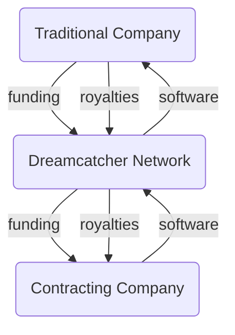

>[!tip] Created: [2023-05-16 Tue 14:30]

>[!question] Targets: 

>[!danger] Depends: 

Traditional companies can still have a traditional outsourcing relationship, except by going thru Dreamcatcher, both sides are kept honest, and by dealing only in packets of software, the salary death trap is avoided.

