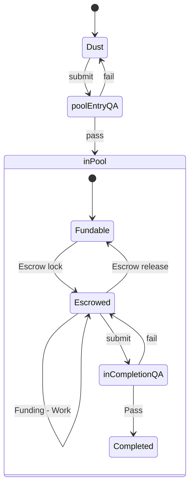

[Obsidian](https://obsidian.md/) appears to be a good baseline for starting the Dreamcatcher from.  It gives us more features than the plain text github version we currently have, and lets us experiment with some usability problems before we waste time building things.

## Setup
Recommended setup for those not familiar with `git` is to download [github desktop](https://desktop.github.com/) and clone the [Dreamcatcher Obsidian Repository](https://github.com/dreamcatcher-tech/network)

Then open Obsidian, and open the folder that the repository was cloned in to.

## Templates
Using as few of the features of Obsidian as are possible, we define here a set of templates for the basic objects of the Dreamcatcher.  Headings are used with [admonishments (aka callouts)](https://help.obsidian.md/How+to/Use+callouts). [Templates](https://help.obsidian.md/Plugins/Templates) can be inserted using the command "Templates: Insert template"

### Idea
>[!tip] Created: [2022-09-14 Wed 21:34]

>[!question] Targets: [[Interpulse]] [[Another Target]]

>[!danger] Depends: [[Some Request]] [[Another Thing]]

Content of the idea goes here
### Request
>[!tip] Created: [2022-09-14 Wed 21:34]

>[!question] Targets: [[Interpulse]] [[Another Target]]

>[!danger] Depends: [[Some Request]] [[Another Thing]]

Content of the Request goes here
### Definition
>[!tip] Created: [2022-09-14 Wed 21:34]

>[!question] Targets: [[Interpulse]] [[Another Target]]

Content of the Definition goes here

### Requests

## Extras
Mermaid can be used directly

Youtube link example:
<iframe src="https://www.youtube.com/embed/00YRYcK6rt8"></iframe>

