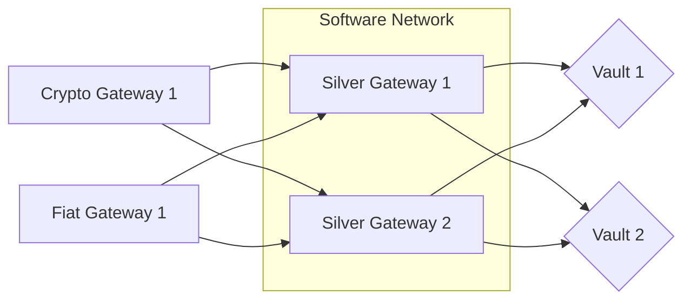

>[!tip] Created: [2022-09-27 Tue 20:49]

>[!question] Targets: [[Dreamcatcher Currency]]

>[!danger] Depends: 

![[DALL·E 2022-09-27 19.34.30 - silver back gorilla with a computer and a vault with thick silver chains around his neck and wrists, digital art.png]]

 *“Gold [and Silver] Is Money, Everything Else Is Credit” - JP Morgan, 1912*

### Situation
Cryptocurrencies have demonstrated excellent transmission of value properties but continually falter at storing intrinsic value.  Fiat value is being tested by inflation, and its transmissibility is being hampered by an ever tightening reporting quagmire.  Silver has good vaulting services but the price appears manipulated, making it susceptible to a short squeeze.  Gen3 blockchains are on the near horizon, and billions of dollars in crypto currency gains needs a new safe, stable home.
### Concept
The idea is to make a stable blockchain currency collateralized by multiple independent silver vaults that provides instant global value storage and transmission with the side effect of causing a silver short squeeze resulting in a payday for all holders and opening of the silver markets.

The cost of vaulting, software, and operating would be met by a small fee extracted from every transaction, effectively allowing members to vault their silver for free.  Liquidity for trading would be provided by holders of the currency pooling their silver in exchange for part of the transaction fee.

The jurisdictional limitations on the currency would be a direct surfacing of each vault's rules, some of which are very permissive.  No other restrictions would apply, making this currency a direct drop in for many of the purposes filled by cryptocurrency.

### Proposal

Using a 3rd gen blockchain, we would make one blockchain for every item of silver in every vault that we wrap.  These objects contain within them the rules which the vault imposes for withdrawal and transfer, based on the vault jurisdiction, and the network fees for transfer.  At that point, the object may be freely transferred around the network, subject to those rules, and may be further fractionalized or take part in extra service offerings made available on the network.

By providing the basic infrastructure by way of software and vaults, all manner of services are free to be initiated at the innovation of all.  Their independence from one another is a strength, and we propose a marketplace where all these services can be easily listed and compared.

We would gain good community cohesion as all who share a quest to shortsqueeze silver should come on board, making them more resilient than a group with no shared goal.  The speculative gains are available to institutions too, as commodities are well understood providing good opportunity for “anchor tenants”.

### Rollout
Initially Silver gateways would need to be set up, to “wrap” the vaults, before the vaults partner directly.  We would set up the initial wrapped vault and a separate entity that does crypto and fiat entry and withdrawals.  The silver gateway would maintain as small an attack surface as possible, set up in the same jurisdiction as the initial vault (most likely Singapore) and would only deal in cleared banked funds.  Speed can be gained by the crypto gateway holding a small float in reserve.

Fees are charged whenever the silver changes hands.  Rough calculations based on [DAI](https://www.coindesk.com/price/dai/), is around 5,000 transactions per day, with $830MM in value, of $6.57B cap.  So, for a 0.25% tx fee, with $10MM per day in transactions, yield is $25,000/day, or $9MM/year just in fees, let alone the appreciation of the collateral.

## Using marshall islands DAOs
DAO can be registered, which has corporate personhood, then this company receives payments from members in exchange for governance tokens.  Then the DAO person acquires vaulted reserves in Singapore and other vaults, and makes these units available for trade.  These tokens can be moved any way you like, but when they want to be cashed out, someone needs to front up with KYC.

### Points
1.  Making money on the trading    
2.  Free vaulting
3.  Easy tradeability
4.  Diversity of vaults
5.  Staking of funds to permit trading
6.  Short squeeze on silver - can vault anything, but not everything is squeezable nor intrinsically valuable
7.  Gain good market rates on silver purchases
8.  Knowledge graph tracking where all silver sources are from
9.  Vault continuous performance monitoring
10.  Every single cost would be market set, since profit from the service is not the goal - short squeeze gains are - so the tx fees are set by the market, not by a fixed service
11.  Always a very specific piece of silver - never fungible, but always fractional
12.  Trading of objects - things - is our software goal
13.  Would generate software and services that could be used for other products, but silver is especially enticing due to the squeeze, and the community around that squeeze
14.  Platform for services on top
	1.  Fungibility services - smelting and combining
	2.  Crypto purchase services
	3.  Crypto exits, to rapidly get out of the silver pool
15. Implementation - can set up a publicly audited company to provide the currency until we can get some dedicated vaulters onboard

## Extensions
Do deals with the vault companies to let people transfer their assets to a special account that is owned by code alone.  It can have restrictions like what KYC 

Vault corps get tx fees people moving in and out, possibly transaction fees of the network.

We can still earn in this model, since the vault co's have to compete with each other based on jurisdictions, fees, trust, and what we offer is a market where consumers can switch between them all, so they are kept honest by being in competition with each other.

If the vaulters do not cooperate to provide an exchange traded fund equivalent, then we can let individual vaulters back the assets, provided they have passed some level of audit.  The vault companies should be able to supply proof of account balance that is shareable if people want to.

Model is to be like DAI, where individuals acquire the assets then pool them to support the currency.

Worst case we would make independent companies that hold the vault reserves as a corporate entity.  Users must decide if they trust them or not.