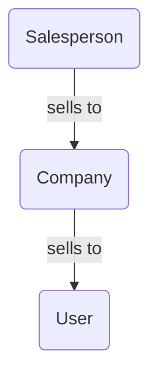
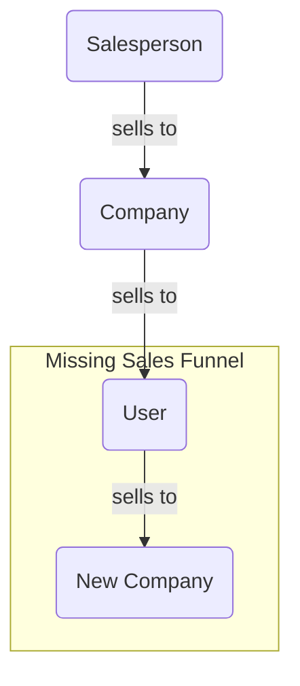

>[!tip] Created: [2022-10-20 Thu 16:22]

>[!question] Targets: [[Tranportable Identity]] [[Unbundled Apps]]

>[!danger] Depends: 

![[DALL·E 2022-10-20 16.47.20 - passports into a small funnel at the top, many more out a large funnel at the bottom.png]]

Should be able to have customers push to use their Raytio ID with companies, instead of requiring a company to be sold on using it first.

Provide a way that members can shove a link at a prospect company, that they can use as a one off  easily, and possibly use as a signup.

Business model is that the easy link requires a manual step from the company, and is free for small usage, but after a threshold, clearly they are getting value and should pay.

Any given user has like, two dozen signups with different companies that they need to maintain a profile with.

Users should be able to track what companies they have a profile with, and see how those foreign companies have interacted with the link they were sent - give the users total control and visibility of these other companies.  Encourage them to get those companies to use the Raytio platform since it is better for the user and the company.  This feeling of power to the user is a reversal from the current set up.

Users can model uncooperative companies and keep track of what documents they sent them.  Can use a raytio generated email address that this company talks with them on, so they know their email address is safe, and they have strong record of what info was sent.  They can reuse these emails with other companies, and rapidly assemble an identy pack for a new company.

Once Raytio have enough users that have modelled uncooperative companies, the sales person can target that company specifically, with the weight of their own customers preferences in hand.

Companies can make Raytio optional to their users to make their adoption easy and gradual.  Offer it as a jump off point in their sign up flows.

Offer commission to users who convince a company to sign up, and who are their first N users.

