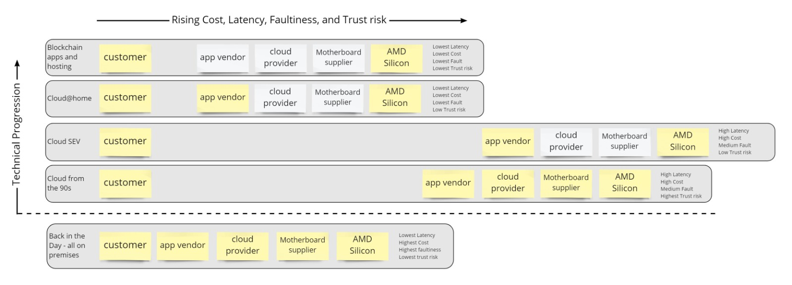

"AMD Silicon" covers wide range too:

1. circuit designers
1. silicon fab
1. supply chain

Our applications must be easily portable to this mode of operation

Need to move to open silicon, with trusted fabs

If cloud@home then the workload is rapidly relocatable, and so the customer may choose to run some base load on prem, have other load on cloud@home, and sell their spare capacity on cloud@home

cloud@home makes use of idle resources, and shares yours out too. you can have enough resiliency for standalone operation in a disaster, but can rent this capacity out when not in use

Show diagram of comparitive trust chains, latency, cost, fault tolerance of cloud configurations

https://www.theregister.com/2020/07/14/google_amd_secure_vm/
So your chain of trust can now be as short as "AMD silicon", Which paves the way for cloud at home type scenarios where renting off a home supplier has the same security guarantees as renting off a cloud supplier

event driven workloads designed for distributed storage - so the workloads would have to be designed specifically for cloud@home unless its just small little apps
