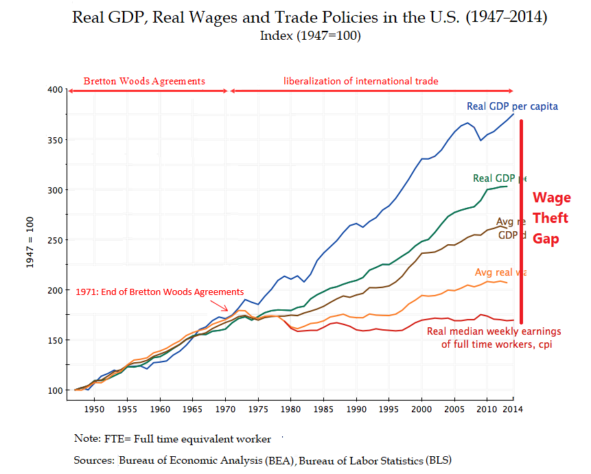
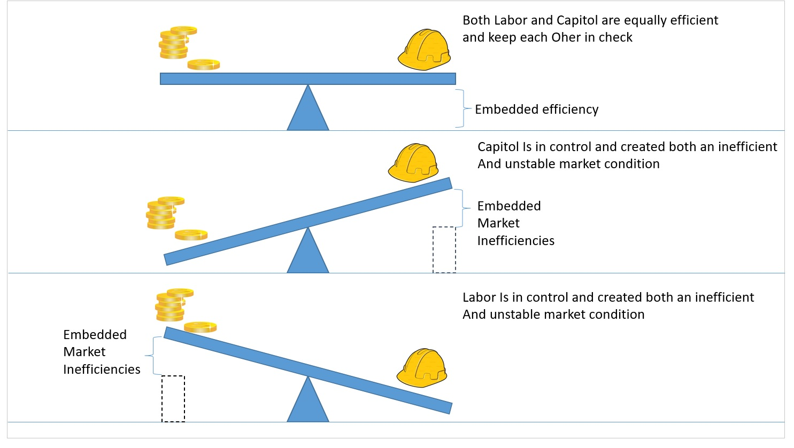

The question was: "When asked "what does the Dreamcatcher do ?" how can we include this graph at the heart of what it does ? "oh it makes things fairer" isn't very precise. Showing the wage theft gap as the addressable market for the Dreamcatcher says it has a lot of potential, in provable numbers, I think ?"

I think we're missing the main point if we talk about removing power from Capital. We're not leading a revolution - we're tuning an old, large engine that could do so much better... But we need to convince Capital and Labour to make it work. We can't do that by being anti-capital.

Bear with me now, as half an eye to turning this into a blog-piece, and typing this on a phone...
Previously we had two main economic models:

Labour dominant: Communism at it's core was to remove influence from capital and rent seekers towards Labour. To do that, it was necessary to centralise as there was no pracical alternative. Guessing I don't need to say why centralisation is bad, other than summarising: few brains = bad; many brains = good.

Capital dominant: Capitalism aimed to decentralise, but failed because of network effects. The more Capital produced, the more than can be produced, and so there's (all else being equal), a exponential effect that accumulates Capital over time. So you inevitably end up with small and reducing group of Capital holders. Not helpful. Again, few brains = bad; many brains = good.

[Sidenote - this distinction between Capital and Labour is outdated, but going to use it as a traditional framework below. By example, the four of us are working together now. Who's Capital and who's Labour? Say if we hire a guy at half pay, and half Attribution? Who's Capital and who's Labour then? The point is the differentiation is in reality blurred - there just hasn't been a practical way to recognise that until now.]
So what we're proposing is a third way.

Many brains <-> Many brains = genius.

NB, no one is losing out here. Both Capital and Labour are improving efficiency. Laying to one side arguments that benefit is relative to your immediate neighbours which you compare yourself with, improving efficiency has got to be a good thing...
AXIOM - Innovation is a good, as of and by itself. Making Innovation more efficient is therefore necessarily good.
So to test this, here's a thought experiment. Two people, one is the Capital guy, the other the Labour guy.

It's important to note that there is a symetry there. The Capital guy can fire the Labour guy, and the Labour guy can fire the Capital guy (by resigning). But there's an asymetry of information - the information gradient.

Have talked about this Information Gradient a bit, but this is more important than it may seem. These two don't live in the same world. Capital guy knows about capital; Labour guy knows how to build stuff to make a ROI. Capital guy knows very little about Labour guy's world; Labour guy knows little about Capital guy's world. So we're now approaching a zero-sum game. Each will be looking out for themselves (of course) - even though it would be to the benefit of both if the Project succeeds.
Therefore:
AXIOM - Wherever that's an Information Gradient, there's an inefficient market.
To dig in to the world as seen by each of the players:

## Capital Guy

The Capital guy is trying to increase his pile by using it to build Stuff, sell Stuff, and make Return on Capital Employed. But he doesn't have the skills, so he needs to give it to some CEO, who will then go off and hire a bunch of people to execute on an idea. To find the CEO he's probably having to look through his local network to N levels of separation, depending on his patience. In my experience, N=2, which is pants.

He then has to offload his own aim of building his pile to this CEO guy, who then goes out to look for talent to build the idea. That's a fraught process, and I'd argue close to being random selection, based on some filter. So the Capital guy ends up worrying about his Contribution being spanked on marketing socks (Tom, Ben, you get the reference), "Tribe Two" consultants out to gouge a day-rate (Tom, yup, you'll also get the reference), and because of the Information Gradient, Capital Guy has no idea whether his pile will increase or disappear.

Worth thinking about that for a moment. Capital guy has close to zero control about whether his Contribution will provide a Return, beyond, well, you know, shouting, firing people, closing the company etc.

The result is that start-up investment is seen as ludicrously risky, and so the risk multiplier means that the Capital guy would be an idiot to not grab as large a percentage of the pie as possible, even before the pie is ready to go in the oven.

In addition, at the early stages, Capital guy has the Information Gradient in his favour. Two guys in a garage vs Round-A $3m...

I do have a lot of sympathy for the Capital guy though. Being out of control sucks. Capital guys doesn't have real control, beyond raising, hiring, firing and folding. So small number of Big Hammers...

## Labour Guy

OK, so other side of the coin, the Labour Guy. Labour Guy has more direct control over what's produced, but they have perverse incentives (cf Adam Smith). You could work hard on what the Capital guy wants you to do, but you're also interested in increasing your pile. How to do that? A smart Labour guy will be trading off working full tilt on the Project, setting up their own Project, maybe gouging for salary while the going is good.

But again the Information Gradient kicks in. Capital guy has identified that there's a large risk, and so will be holding as much of the pie as possible for as long as possible. Labour guy can bake that pie, but won't go full tilt if he's not going to get any. It's a zero-sum game.

Again, Information Gradient = inefficient market.

So we get the weirdness of two groups, who if they cooperated with each other could build The Thing, expecting that it's a zero sum game and, using the tools each have to hand, trying to maximise their own return not the important thing, which is to see whether That Thing is useful in the market.

## Dreamcatcher

AXIOM: Dreamcatcher intends to reduce and ultimately remove the inefficiencies we see now in Innovation.
From the Capital guy's point of view, the ideal situation is that the Labour guy is working full tilt on the Project. Ie, there's zero Information Gradient between what the Capital guy wants and what the Labour guy wants.

From the Labour guy's point of view, the ideal situation is that the Capital guy will give him his full worth of the effort he puts in. Ie, there's zero Information Gradient between what the Capital guy wants and what the Labour guy wants.

So there's a potential here that there is no information gradient, and that both groups have exactly the same incentives
And that's my point. Dreamcatcher isn't anti-capital, anti-rent-seakers (although I hate rent-seekers). It is about working towards making Innovation maximally efficient, which isn't a zero-sum game. If it works, everyone benefits...
@everyone Feel passionately about this. Know we have a lot going back and forth, but would love it if one of you guys would kick the shit out of what I've said above. Right now, for me, that reduction in inefficiency of innovation is everything, and we need to lead with that not being a zero-sum game...
