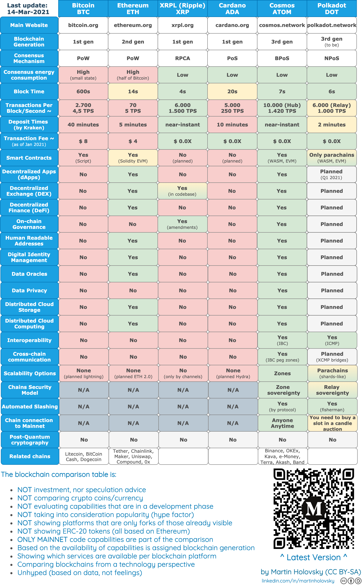

Ideally we can construct some kind of comparison that helps us navigate the broad range of competitors in a standardized way, so that we can compactly share info with each other, and to newcomers.

Each chain or project would have a page dedicated to it in "Comparisons" and would summarize based on the standard way we analyze competitive chains. May also include some short blurbs about other points of interest. These individual standard summaries would then be surfaced in this page, where at a glance we could see across many different chains

In this way, each of us can nudge forwards the understanding we have about each competitor, and share it in a way that is easy to skim over for others, rather than each of us having to analyze each competitor individually, due to the high number of competitors which only ever seems to be increasing.

As a template, I propose the following, bearing in mind that nothing is required:

1. Link to project homepage
2. Launch date
3. [Tech Readiness Level](https://en.wikipedia.org/wiki/Technology_readiness_level)
4. Transactions per second
5. Smart contract language
6. Chain interconnect method
7. Coin stability method

Hopefully we can end up with a table similar to this:

