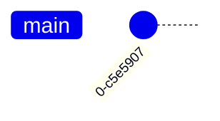
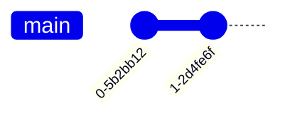
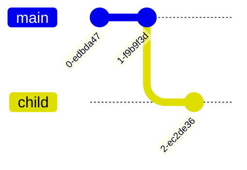
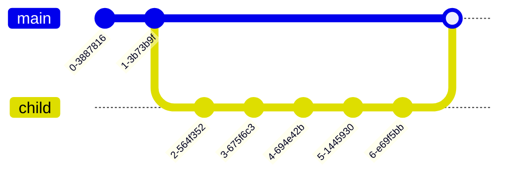
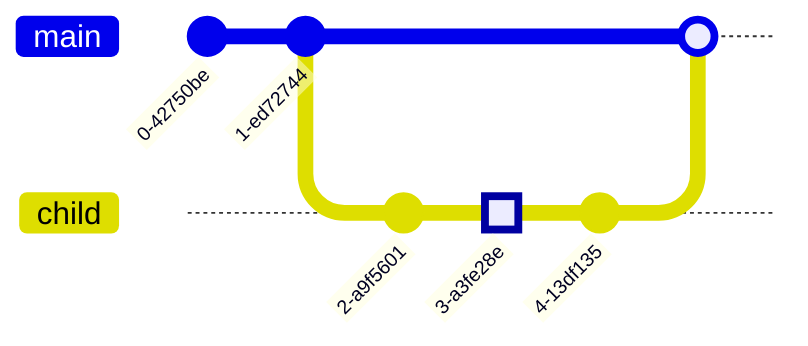
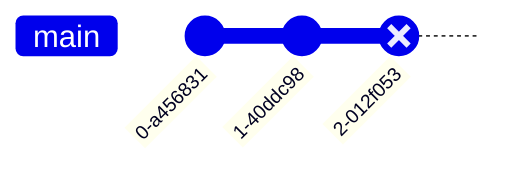
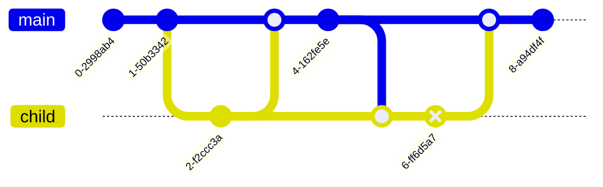

# R06 Interblock

## Strategic Intent

Produce a 'universal computing surface' designed for Object Oriented Programming where those Objects are Serverless.

1. Runs on a distributed network of small devices, such as phones.
1. Does not require any centralised back-end servers.
1. Allows permissionless addition of devices to the network without compromising the network.
1. Provides computation and storage resources by distributing the workloads to be done throughout the distributed network of devices.
1. Provides mesh network connectivity between devices to allow data to flow regardless of the availability of any centralised comms network.
1. Provides that mesh network over as large a number of connection means as possible, including: cellular, ethernet, bluetooth and sneakernet (where the connection is made physically.)
1. Allows for data transfer to be delayed owing to the transfer medium without impacting the veracity of the data transferred. E.g. allowing a USB stick to be used as the transport layer, and connect again to the network after an aribtary period of time.
1. Does not rely on any centralised control or coordination. I.e. no 'master' nodes - all nodes should be peers and should not have a preferential position in the functioning of the overall system.
1. Provides a persistent data store that cannot, reasonably, be deleted or corrupted without compromising multiple nodes.
1. Provides a method for users to interact with the system in a manner that may be anonymous, but nevertheless in which key holders can prove ownership/identification on the network.
1. Provides a computing surface on which others can write and run Apps without centralised permission, but with permission of the user running the Apps.
1. Allows for the creation of groups and the control of membership of a group through the governance agreed by that group. Within a group, privacy is ensured through an effective 'walled garden', where only those in a group have visibility of that group's chains', access to the discovery of those chains and the locations of nodes in use by that group. This effectively limits network traffic analysis to within a group.
1. Provides the option of joining a public group where membership is not controlled, and therefore network traffic analysis may be carried out

## Tactical Intent

1. Privacy of participants is controlled by permissions set within the Objects
1. Developer Experience is simple and quick to learn

## Detailed Description

### Tactical Intent 1: Privacy of Participants

#### Must

1. Encrypt all data at rest
1. Encrypt all data in flight

#### Should

1. Build atop of the [privacy stance of IPFS](https://docs.ipfs.io/concepts/privacy-and-encryption/#what-s-public-on-ipfs)

#### Could

#### Must not

1. Confirm or Deny the existence of an Object if the requester has no permission to access the object
1. Leak metadata about other Objects that are connected to any given Object that the attacker has a connection to
1. Leak info about what Objects a participant is accessing to those without access to each Object

## Required object operations

This list of operations should be contrasted to a list of conventional object oriented operations. Some operations, like storage, scale, multithreading, transmission will be very simple in interblock terms, but very hard or poorly defined in conventional terms.

Maybe some measurement in terms of time to execute and energy cost of each operation.

These models should be extendable to the construction costs of objects

### 1 Block

### Next Block

### Child

### Child Reply

### Delayed Reply

### Delete

### Delete Child

### Loopback

### Query
