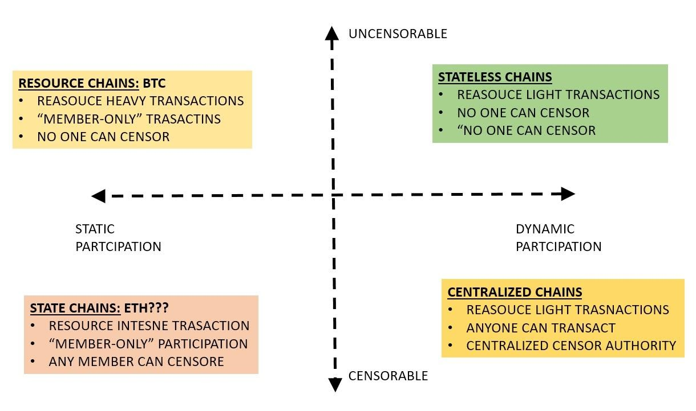
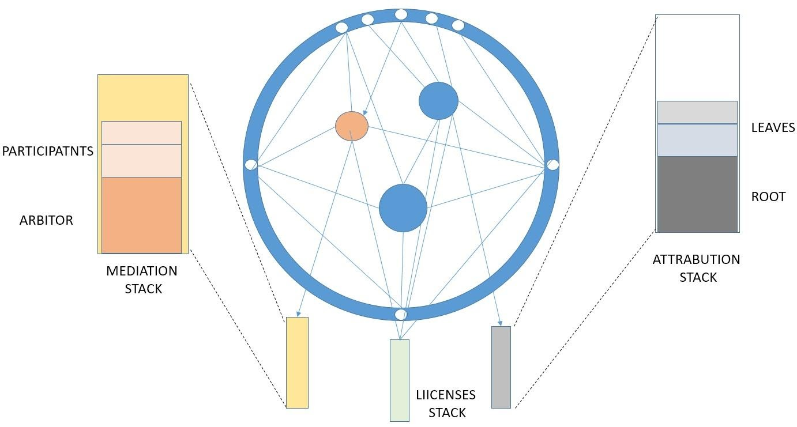
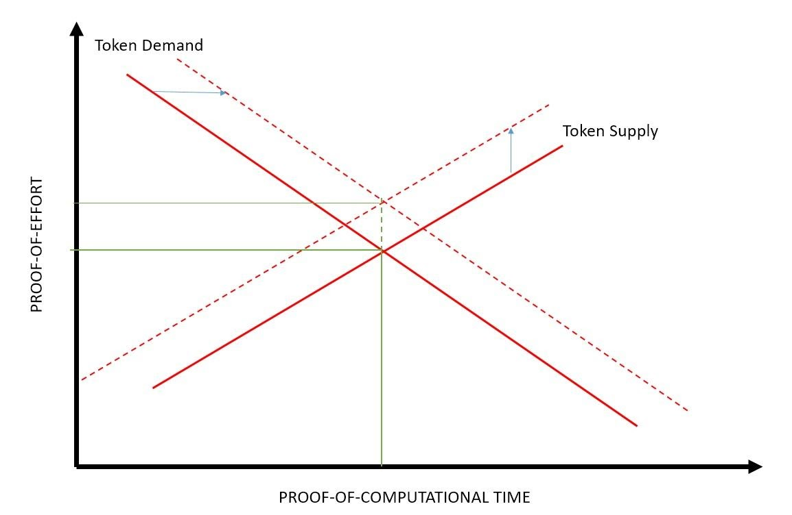
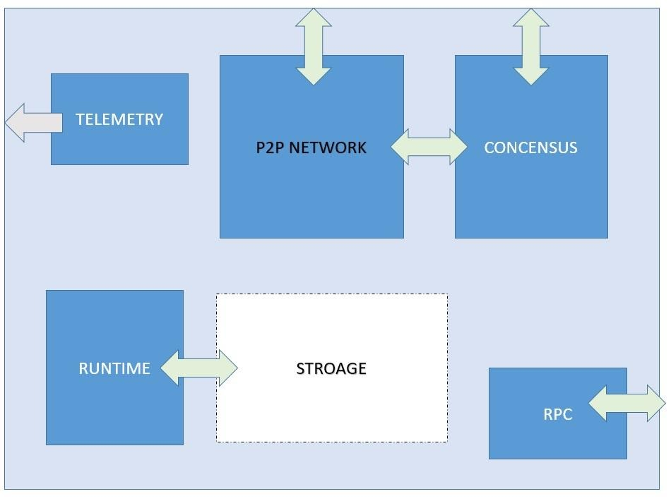

1. PURPOSE

   The purpose of this document is to specify the software and operational code requirements for the Dreamcatcher protocol system. In addition, this document will set forth the requirements and constraints for application and algorithm development.

1. SCOPE

   This document applies to the Dreamcatcher protocol source code residing in the system. It describes the requirements for the overall functioning of the multi-chain protocol and specifies the requirements for interactions of the protocol, its license dependencies, and the users and / or smart contracts.

   The dreamcatcher is a participation blockchain space whose members on the chain are considered stateless persons.

   

   The Dreamcatcher protocol is an immutable blockchain space that has dustless operational. Dreamcatcher is both the substrate and engine for attribution monitoring equity distribution, and mediation layers. The attribution layer stack sites on top the dreamcatcher infrastructure. The attribution stack is made up of a root attribution which is the original artifact object by the original owner of the object. Any all proceeding attributions sit on top of the root attribution as attributing leaves. As more and more participants contribute to the underlying asset the attribution stack grows. The dreamcatcher protocol monitors, tracks, and accounts for every attribution and distribution in blockspace.

   

   This image needs to be done in illustrator/should look like dreamcatcher. (See pokadot material)

   Any dispute between dreamcatcher participates are encouraged to use the mediation control flow stack. There participants agree to mediate their dispute about: ownership, escrow, attribution/equity share, timing, etc. with an arbiter. This gives the dreamcatcher protocol the unique permissible jurisdiction status of being the only decentralized jurisprudence mechanism

   The protocol is driven by a token call Dreamcatcher Compute Units (DCU). Any resource, work, time, validation, etc. demanded of the dreamcatcher must be paid for in DCU.

   A DCU is both a proof of utility for the protocol and a medium of exchange for: peer-to-peer transactions, therefor the a DCU unit is a proxy for both a utility token and currency simultaneously. The first factor underlying the DCU is Proof-of-Effort (POE). POE is bulk metric of overall effort put into the blockchain space by users, code, art, contracts, or any other measurable input metric. The other side of the DCU is the Proof-Of-Computation (POC). The POC unit value is based on the amount of time it takes to utilize the resources required by the DCM to facilitate the Dreamcatcher protocol. The DCU can be used attribution distribution, etc.

   Dreamcatcher Compute Units are algorithmic driven and a constantly rebased token based on the supply and demand of the bulk unity space. The utility space is where the x and y axis are proof-or-effort vs proof-of-computational time. In order to keep the unit price consistent an Automatic Market Maker (AMM) will increase or decreases the overall token supply such that (1) unit of Proof-of-Computation Work equals a sustainable pegged value of Proof-of-Effort that is put into the protocol space. (see figure x below)

   

   1.1 Use cases
   As an open source framework, Dreamcatcher is designed to bolt on to existing applications or completely customizable for specific product needs.

Examples

- Existing online game that would like to NFT their assets
  - Game publication firms that would like bolt on a blockchain solution without rewriting their entire source code.
- Companies that need enhanced MRP/ERP raw materials, product and end of life tracking

3. DEFINITIONS

The following definitions apply for this document.

- DCU
- NFT
- Blockchain
- GUI
- TBD

4. REFERENCES 1. Internal References 1. Dreamcatcher Constitution 1. Dreamcatcher Dictionary 1. Dreamcatcher Public license – DPL 1. External References
   (TBD)

5. GENERAL ARCHITECTURE

5.1 Product Perspective

Dreamcatcher core protocol is a permissionless multichain infrastructure and engine driving an embedded unbiased distribution and attribution engine.

Dreamcatcher protocol uses an approach referred to as has a smart license layer in conjunction with a persistent reciprocity and mediation mechanism that sits on top of the core blockchain infrastructure

Dreamcatcher uses an open-source modular blockchain substrate that is external protocol agnostic. Dreamcatcher is meant to be customizable and sit on top of and interacts with: existing protocols, projects, new token standards, exiting payloads, interfaces, smart contacts, or other external infrastructure without them being disrupted.

5.2 Protocol Function Overview

The protocol described in this document will control all of the separate processes, operator interface, UI clients calls, attribution, contribution and reciprocity subroutines.

5.3 Storage

Used to persist the evolving state of a Substrate blockchain. The blockchain network allows participants to reach trustless consensus about the state of storage. Substrate ships with a simple and highly efficient key-value storage mechanism

5.4 Runtime

The logic that defines how blocks are processed, including state transition logic. In Substrate, runtime code is compiled to Wasm and becomes part of the blockchain's storage state. This enables one of the defining features of a Substrate-based blockchain: forkless runtime upgrades. Substrate clients may also include a "native runtime" that is compiled for the same platform as the client itself (as opposed to Wasm). The component of the client that dispatches calls to the runtime is known as the executor, whose role is to select between the native code and interpreted Wasm. Although the native runtime may offer a performance advantage, the executor will select to interpret the Wasm runtime if it implements a newer version.

5.5 Peer-to-peer network

The capabilities that allow the client to communicate with other network participants. Substrate uses the Rust implementation of the libp2p network stack to achieve this

5.6 Consensus

The logic that allows network participants to agree on the state of the blockchain. Substrate makes it possible to supply custom consensus engines and also ships with several consensus mechanisms that have been built on top of Web3 Foundation research.

5.7 RPC

(remote procedure call): the capabilities that allow blockchain users to interact with the network. Substrate provides HTTP and WebSocket RPC servers.

5.8 Telemetry

Client metrics that are exposed by the embedded Prometheus server.

5.9 General Constraints

Functions will be developed and used as a multichain protocol. It will be the only core “Mainnet” protocol that will contain all routines needed to fully control the code of behavior, including all best known client interfaces with users and all required core and modular license functionality.

5.10 Assumptions/Dependencies

It is assumed that the majority of the core protocol software will be written in the language required for the best interfaces across a majority of external use cases. This protocol will be written to existing development specifications where possible. Developers may be given considerable leeway to deviate from the development specifications if it is deemed necessary to compensate for the constraints of the core protocol functionality.

6. SPECIFIC REQUIREMENTS

6.1 Top Level Functional Requirements

| ID       | TL Functional Requirement           | Requirement                           |
| -------- | ----------------------------------- | ------------------------------------- |
| 6.1.1    | Object                              | ID Shard Chain                        |
| 6.1.2    | symLink                             | Inheritance link                      |
| 6.1.3    | Selector (Covenant)                 | Pure lookup                           |
| 6.1.4    | Branch (Object)                     | Fork of clone object                  |
| 6.1.5    | Origin (Object)                     | Fork source object (Name Collision)   |
| 6.1.6    | App                                 |                                       |
| 6.1.7    | Project Creation                    |                                       |
| 6.1.8    | Shallow Fork                        | Intrablock fork                       |
| 6.1.9    | Deep Fork                           | Fork that includes every inheritance  |
| 6.1.10   | Target                              | The pull request object               |
| 6.1.11   | Origin (Pull request)               | Name Collision                        |
| 6.1.12   | Proposer                            | Pull request Author                   |
| 6.1.13   | Merge (workflow)                    | Concatenation of similar objects      |
| 6.1.14   | Fork (workflow)                     | New clone object from exisitin object |
| 6.1.15   | Terminus Fork/Merge                 | Orphaned Fork                         |
| 6.1.16   | Hierarchy                           | Supervisor Tree                       |
| 6.1.17   | History                             | Full state of the chain braid         |
| 6.1.18   | Inbox (Object)                      | All incoming Weak Links               |
| 6.1.19   | OutBox (Object)                     | All outgoing Weak Links               |
| 6.1.20   | Weak Link                           | Undefined                             |
| 6.1.21   | Messaging (Object)                  | Layer holding inbox and outbox        |
| 6.1.22   | Vision Dream (Object)               | Founding ideas                        |
| 6.1.23   | Consumer (Typeof Person)            | Project that uses an object           |
| 6.1.24   | Governor (Typeof Person or Project) | Project control flow                  |
| 6.1.25   | ProjectAlgo (typeof: App)           | Compiled project                      |
| 6.1.25.1 | GovernanceAlgo                      | Control flow pull request handling    |
| 6.2.25.1 | combinerAlgo                        | Control Flow logic                    |
| 6.1.25.3 | MeasurementAlgos                    | Object Tester                         |
| 6.1.26   | Desiderate Wish (Object)            | Change Pull Request                   |
| 6.1.27   | Citation (typeof Dependency)        | Beneficiary of Asset object           |
| 6.1.28   | Frame (typeof combinerAlgo)         | Query filter                          |
| 6.1.29   | Demand                              | Data selector summery                 |
| 6.1.30   | Investor                            | Project Funds object                  |
| 6.1.31   | Contributor                         | Project Submitter                     |

6.2 Core Protocol Architecture

| ID     | Functional Requirement                      | Requirement                             |
| ------ | ------------------------------------------- | --------------------------------------- |
| 6.2.1  | Attribution (Object)                        | Distribution agreement                  |
| 6.2.2  | Attribution Algorithm                       | Distribution control flow               |
| 6.2.3  | Dispersal (Event)                           | Distribution control flow emit event    |
| 6.2.4  | Attribution Table (Selection)               | Attribution array stack output          |
| 6.2.5  | Origin (Object)                             | Name Collision                          |
| 6.2.6  | Branch (Object)                             | The fork form an object                 |
| 6.2.7  | Outputs (Object)                            | ???                                     |
| 6.2.8  | AXIOMS                                      | Chain of custody evidence stack         |
| 6.2.9  | Pull Request Contract                       | Pull request reward                     |
| 6.2.10 | Pull Request                                | State Change request                    |
| 6.2.11 | Negotiation                                 | Internal offer                          |
| 6.2.12 | Remittance                                  | External Pull request to an attribution |
| 6.2.13 | Dependency (Object)                         | Child object                            |
| 6.2.14 | Governance                                  | Voting right access control             |
| 6.2.15 | Governance Table (Selection)                | Control flow history                    |
| 6.2.16 | Issue                                       | Proposed change                         |
| 6.2.17 | Milestone                                   | Compiled issue timing and ordering      |
| 6.2.18 | Project                                     | The compiled state of a going concern   |
| 6.2.20 | Projects (Object)                           |                                         |
| 6.2.21 | Project Apps                                |                                         |
| 6.2.22 | Bank                                        | Project funding                         |
| 6.2.23 | Person                                      | Single user                             |
| 6.2.24 | Arbiter                                     | External referee                        |
| 6.2.25 | Upvote/Downvote                             | Support/disapproval                     |
| 6.2.26 | Annotation                                  | Information layer on the chainscape     |
| 6.2.27 | Contract (typeof: Annotation)               | Conditional posed on state objects      |
| 6.2.28 | Prediction (typeof: Annotation)             | Futures                                 |
| 6.2.29 | Asset                                       | External DCM objects                    |
| 6.2.29 | Idea                                        | Possibly Redundant                      |
| 6.2.30 | Artifact (Object)                           | Compiled state of all object sets       |
| 6.2.31 | Instance Project                            | Possibly Redundant                      |
| 6.2.32 | Observer (Typeof: Project/Instance Project) | Critical mass of data                   |
| 6.2.33 | ObserverEvent                               | Compiled Observer data                  |
| 6.2.34 | Dissent (stub)                              | TBD                                     |
| 6.2.35 | Evidence (typeof Frame)                     | The factual information stack           |
| 6.2.36 | EvidenceAlgo (typeof: ProjectAlgo)          | Verification algo                       |
| 6.2.37 | Real                                        | Verification Boolean (TRUE)             |
| 6.2.38 | Identity (subtype of an artefact)           | Distinguished information               |
| 6.2.39 | Parameters (object)                         | Extension of identity objects           |

6.3 Attribution Algorithm

| ID    | Functional Requirement | Requirement                  |
| ----- | ---------------------- | ---------------------------- |
| 6.3.1 | hotPathAlgo            | Call number for distribution |
| 6.3.2 | negotiatedAlgo         | Agreed Distribution          |
| 6.3.3 | mostLinkedAlgo         | Citation number              |
| 6.3.4 | effortAlgo             | Resolved Issues????          |
| 6.3.5 | SetAttMapping?         |                              |

6.4 Performance Algorithm

| ID    | Functional Requirement | Requirement                   |
| ----- | ---------------------- | ----------------------------- |
| 6.4.1 | compliesWithLicense    | License compliance output     |
| 6.4.2 | stackRank              | Rank stack output             |
| 6.4.3 | manualMultiDimensional | Manual review and validation? |
| 6.4.4 | benchmark              | Code test results             |
| 6.4.5 | Popularity             | Project output citation       |

6.5 Governance Algorithm

| ID    | Functional Requirement | Requirement                         |
| ----- | ---------------------- | ----------------------------------- |
| 6.5.1 | projectShareAlgo       | Flat and even vote distribution     |
| 6.5.2 | contributorAlgo        | Vote share distribution             |
| 6.5.3 | consumerAlgo           | Vote distribution based on revenue  |
| 6.5.4 | governorAlgo           | Is assigned votes distribution      |
| 6.5.5 | personAlgo             | Vote claimed at any decisions event |
| 6.5.6 | tiebreakerAlgo         | Nominated to break tie              |
| 6.5.7 | arbiterAlgo            | Mediation control flow              |

6.6 DCM Dictionary

| ID     | Functional Requirement           | Requirement                                 |
| ------ | -------------------------------- | ------------------------------------------- |
| 6.6.1  | Birthing                         | A new child instance of a parent object     |
| 6.6.2  | Sovereign Object (Object)        | An addressable object in chainspace         |
| 6.6.3  | Chainspace                       | The totality of object nodes                |
| 6.6.4  | add (command)                    | New object from a template                  |
| 6.6.5  | rm (command)                     | Chain self-destruct                         |
| 6.6.6  | Update (command)                 | Action to update date within an object      |
| 6.6.7  | Workflow                         | ???                                         |
| 6.6.8  | Subscribers                      | ???                                         |
| 6.6.9  | cat [Object] (command)           | Print data in the specified object          |
| 6.6.10 | cd (command)                     | Change the current directory                |
| 6.6.11 | chainID (address)                | Chain object location                       |
| 6.6.12 | Parent (stub)                    |
| 6.6.13 | Child (stub)                     |
| 6.6.14 | Children (Object data structure) | The hierarchical data tree structure        |
| 6.6.15 | Collection (covenant type)       | A dynamic set of objects                    |
| 6.6.16 | connect (command)                | P2P connection via symlink                  |
| 6.6.17 | Covenant (Object)                | ???                                         |
| 6.6.18 | Datum (covenant type)            | Object internal reference frame             |
| 6.6.19 | datumTemplate                    | Object configuration to a datum template    |
| 6.6.20 | DCM Instance Structure           | A users instance                            |
| 6.6.21 | find (command)                   |
| 6.6.22 | Install (command)                | Initiates an instance                       |
| 6.6.23 | ls (command)                     | Current folder of structure specified       |
| 6.6.24 | Object (data structure)          | Running instance data                       |
| 6.6.25 | Permissions                      | Access control flow                         |
| 6.6.26 | Template                         | Structure require to initialize an instance |
| 6.6.27 | Property (data structure)        | Data held within data object                |
| 6.6.28 | publish (command)                | App store registry bundles                  |
| 6.6.29 | Schema (data structure)          | The object template structure               |
| 6.6.30 | UISchema (data structure)        | The objects user interface                  |
| 6.6.31 | Workflow                         | The structureed control flow of work        |

6.7 DCM Orphaned Terms Dictionary

| ID  | Functional Requirement             | Requirement |
| --- | ---------------------------------- | ----------- |
|     | addresses                          |
|     | smax                               |
|     | appStore                           |
|     | catalogue                          |
|     | appStoreRegistry                   |
|     | myApp                              |
|     | Dreamcatcher                       |
|     | Projects                           |
|     | Crm                                |
|     | Files                              |
|     | Genesis Block (stub)               |
|     | Addressbook (stub)                 |
|     | Active Fork (stub)                 |
|     | Chain (stub)                       |
|     | AppStore (stub)                    |
|     | Dreamcatcher (stub)                |
|     | Weights (stub) - optional input to |
|     | combinerAlgo                       |
|     | combinerAlgo (stub)                |

6.8 Core Protocol Overview

This Core protocol will allow the operator to control all of the normal functionality of the blockchain space. The core protocol consists of the following functionality:

The software will provide the means to interface and interact with the functionality of each of the above named attributes.

6.9 Interface Requirements

6.9.1. Command Line Interface

The default output user interface will be a command line interface. This interface shall be compatible with all know operating systems and internet backbone infrastructure.

6.9.2. Graphical User Interface (GUI)

- A Graphical User Interface (GUI) will sit on top of and overlay the command line interface to help facilitate usability.

- A GUI interface is considered a client interface to the blockchain

- The GUI shall be an interactive client written in software the is readably available and easy to modify

- THE GUI needs to be intractable client that is compatible with most operating systems and internet backbone infrastructure.

  6.9.2.1 The GUI shall display the following information in concise readable format, layout and style;

- Public Key

- Private Key seed phrase entry

- Encryption (Lock Icon)

- Token Binance

- Network/Blockchain status

  - SYNCED – Green symbol

  - DESYNCED – Red or grayed out symbol

- Transaction Status
- INBOX
- DPL status
  - NONE
  - P2P
  - SIGNED
  - KYU
  - ARBITRATOR
  - MODIFIED
    - MODIFICAION STATUS
    - NDA
    - KYC
  - (TBD)
- Reputation status

  - GOOD STANDING
  - POOR STANDING
  - NONE
  - (TBD)

    6.10. Performance Requirements

    6.10.1. Know Good software best practices will be adhered to for clarity, security, or transparency

    6.10.2. Maximum block process time shall be no greater than 90 microseconds.

    6.10.3. The blockchain will be designed to allow the process to complete in less than 90 microseconds

    6.10.4. Quick response to block chain transaction updates transaction or GUI delays in the system with regard to transactions with the blockchain shall be minimized for operator convenience.

    6.10.5. Unexpected errors and system failures will require client to be cycled.

    6.10.6. Any unexpected failures detected in the core protocol will cause the core blockchain in an un-recognized state and possible unrecoverable state. No graceful failure is allowed

    6.10.7. Loss of client.

The system shall shut down in a safe manner when power is removed either deliberately or accidentally.

6.10.8. The user inputs for processing with the standard defaults should be less than 5 distinct items.

| Parameter            | Type | Description |
| -------------------- | ---- | ----------- |
| Salt                 |      |
| Channel              |      |
| signerAddress        |      |
| data                 |      |
| isValidHashSignature |      |
| isValidTxSignature   |      |

| Signatures | Type      | Description                                                                                       |
| ---------- | --------- | ------------------------------------------------------------------------------------------------- |
| 0x00       | illegal   | This signature type will always revert                                                            |
| 0x01       | invalid   |
| 0x02       | Arbiter   |
| 0x03       | User Sign |
| 0x04       | Wallet    |
| 0x05       | Validator |
| 0x06       | PreSign   | Allows any address to sign a hash on-chain by calling the preSign method on the Exchange contract |
| 0x07       | Delgate   | It allows a contract wallet to trade on behalf of any other address(es)                           |

| Exchange Events            | Type | Description |
| -------------------------- | ---- | ----------- |
| fill                       |      |
| cancel                     |      |
| TxExecution                |      |
| SignatureValidatorApproval |      |
| AssetRegistered            |      |
| AuthorizedAddressAdded     |      |
| AuthorizedAddressRemoved   |      |
| Submission                 |      |
| Confirmation               |      |
| Execution                  |      |
| MatchedDCLResults          |      |
| Reverts                    |      |

| Error                              | Type | Description |
| ---------------------------------- | ---- | ----------- |
| TxStatusError                      |      |
| TxError                            |      |
| TxExecutionError                   |      |
| TxInvalidContextError              |      |
| IncompleteConractError             |      |
| SignatureError                     |      |
| SignatureWalletError               |      |
| SignatureValidatorNotApprovedError |      |
| PayEscrowError                     |      |
| LibMath Errors                     |      |
| SenderNotAuthorizedError           |      |
| AssetDispatchError                 |      |
| AssetTransferError                 |      |
| AssetExistsError                   |      |
| TargetAlreadyAuthorizedError       |      |
| TargetNotAuthorizedError           |      |
| ZeroCantBeAuthorizedError          |      |
| InvalidOperationError              |      |

| Query Tx State | Type | Description |
| -------------- | ---- | ----------- |
| Filled         |      |
| Cancelled      |      |
| TXEpoch        |      |
| GetTxInfo      |      |

6.2 Development Tools

An JAVASCRIPT specific integrated development environment shall be selected to edit create, build, debug, and test the core blockchain, client, and other dependent objects. The resultant outputs shall be a file(s) suitable for loading into the specific clients and/or command shells for user interaction

6.3 Design Constraints

TBD

6.4. Contracts

6.4.1. ERC20 Proxy -> Wrapped DCT

6.4.2. ERC721 Proxy-> Wrapped DCT

6.4.3. Multi-Asset Proxy-> Wrapped DCT

6.5. Contract Interactions

6.5.1. Trade Settlement

6.5.1.1. ERC20 <-> DC Diagram

6.5.1.2. Settlement control flow

6.5.1.3. ERC721 <-> DC Diagram

6.5.1.4. Settlement control flow

6.5.1.5. DCU <-> AMM

6.5 Software Version Change

After the initial source code and license file release, formalized software version changes will be performed only as the result of a verified and tested pull request (i.e. Change Order (CO)). A new version number(s) and pragma will be assigned to any authorized software changes and the version number will reflect the signoff date of the DRR

7.0 CORE BLOCKCHAIN OPERATIONS

7.1 General Functional Requirements

The Dreamcatcher protocol operates by xxx

(Tom needs to answer this question).

The Dreamcatcher protocol will contain an user interface that will allow an automated process to be run and a technician interface for calibrating and testing features.

7.2 Blockchain Fault Handling

7.2.1 Contract State revert feedback

Fault conditions detected with the revert feedback shall place the system in panic condition.

7.2.2 Centrifuge controller feedback

7.2.3 Block generation feedback

7.3 Protocol Overflow

7.3.1 TBD

7.3.3 Display and Switch

A display for emergency OpCode: STOP, BACK, and NEXT.

7.3.3.1 The emergency withdraws or revert is the only active user interface while….

7.4 State Machine Operation Overview

7.4.1 State Machine Operation

A state machine will be generated in the logic of the two interfacing contracts, transactions….

7.5 Warning and Alarms

7.5.1

7.5.3

7.5.5 Operator correctable errors will pause any running process.

Error conditions that can be corrected or cleared by the user shall be handled as warnings.

Indication of the warning shall be initiated with a visual text message and an audio tone alerting the user to the condition.
Tone alarm can be cleared by activation of the CLEAR button.
Upon correction of a warning condition, the system shall return to the process in a manner that will continue the process from where it was paused.

7.5.6 Errors that cannot be corrected by an operator will halt the process.

Error conditions that cannot be corrected by the user or pose a halting hazard shall be handled as PANICS. In this case, the system shall enter a safe condition that can be cleared only by…..
Indication of the alarm shall be initiated with a message and an audio tone alerting the user to the condition.
The alarm audio tone can be cleared by activation of the CLEAR button.

8.0 SOFTWARE REQUIREMENTS

8.1 Functional process description

8.1.1 Genesis Block

The protocol

8.1.2 NORMAL mode. Initialization and Self Test Process

8.1.3 Run Process

- System will prompt user to connect the blockchain
- System will recognize client
- Verify operation of all client checks
- Verify colour network sensor
- Verify keys status:
  - Public key wallet address
  - Private Key encryption
- Verify DCU Token Binance
- Verify. Network/Blockchain status
  - SYNCED – Green symbol
  - DESYNCED – Red or grayed out symbol
- Verity Transaction Status
- Verify INBOX Status
- Verify DPL status
  - NONE
  - P2P
  - SIGNED
  - KYU
  - ARBITRATOR
  - MODIFIED
- Verify MODIFICAION STATUS
  - NDA
  - KYC
  - (TBD)
- Verify Reputation status

  - GOOD STANDING
  - POOR STANDING
  - NONE

- Verify that .
- Ensure
- Prompt user to….
- User presses…..
- Prompt user if .
- After completion of transaction prompt user with msg/tone
- Process is complete

  8.1.4 Technician Mode – recovery

Activation of BACK and PRESS button while powering up shall place the system in the DEVELOPER mode. This mode provides a capability to manually activating the features of the UI and provides a means to verify operation of the following functions:

Private Keys status and seed phase recover

Network fault error codes
