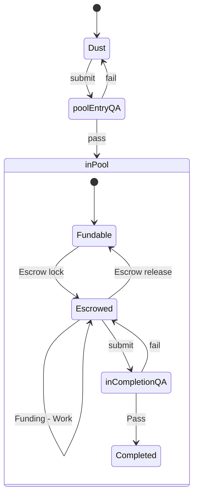

# I11 Request-Idea

## Version

2022-05-02 v0.1 - Pre-pool

## Target

[R10 Request-Idea]

## Inherits

## Dependencies

## Outputs

1. [R10 Request-Idea]
1. [I11 Request-Idea]
1. [Request Template]
1. [Idea Template]
1. [Pool.md]
1. [Pool Process]
1. [Pool Governance]
2. Existing App Concepts in Pool, Escrow.

## Concept

We want to encourage Requests and Ideas to be written down, no matter how vague, as early as possible, then provide a route to move from that vagueness through to having them admitted to a Pool, executed and produce Outputs. To do this we'd set up areas in git where md files flow through the following process:

## Diagram Definitions

1. Dust: Any Request or Idea that has not been accepted by Pool QA for entry. In this state they can be as rough or as complete as you want - no-one's checking. This is the entry area into the process. NFTs images will be generated by the Worker, one per Request/Idea.
2. poolEntryQA: Being considered by the QA appointed by this pool as to whether it meets the formating/content standards that that pool has stipulated. NFT images are required to pass QA and must be of suitable content and unique.  For an Idea to pass poolEntryQA it must reference a Request, and QA must be satisfied that it is coherent with that Request.  That is, it must address at least one of the Request's Tactical Intents, and must not be incompatible with any of the Musts/Must Nots in all of the Tactical Intents in that Request.  Moreover and more broadly, it must further the Request's stated Strategic Intent.  
3. Fundable: The Request/Idea now has met the standards required by the pool, is available for Workers or Funders to contribute to in a permissionless manner but not under escrow. A running total of the time/payments spent to date are recorded.
4. Escrowed: A contract has been negotiated between a Funder and a Worker for delivery of all or parts of the Outputs stated in the Idea, with funds put in escrow. A running total of the time/payments spent to date are recorded, and for any escrow payments made, the fact of that payment is also recorded.
5. inCompletionQA: The Output Asset(s) have been worked on to the extent that they can be submitted to QA to check whether the work in the linked Idea, which references a Request, has been completed. I.e. did it do what it said it would do?  To be accepted at this stage, QA must satisfy themselves that the Outputs->Idea->Request bottom up stack is coherent.  That is, the Output meets some or all of the requirements of the Idea, and that by doing so does not violate any of the Musts/Must Nots in the Request that the Idea targets.  Note that this submission of Outputs does not need to reference the original Idea or Request, and may reference more than one Idea or Requests, but in all cases the Ideas and Requests referenced must be in the Pool.
6. Output: the Assets produced from the work are now available for use, having passed QA. These Outputs come with the context of one or more Idea which it meets the requirements of, and that for each referenced Idea, the Output does not violate any of the Requests which those Ideas are attempting to fulfil.  Note that for an Output to have reached this state there must be at least one Output->Idea->Request stacks.

When funds are escrowed they come with a lock, which allows QA to release them based on the contents of the contract, which references the Idea or part of the Idea, and whether they judge that contract to have been completed. That lock can time out, or the worker can declare failure, or both parties agree not to proceed, at which point escrow is released back to the funder and the Idea moves back to Fundable state in the pool if there are no further escrows in place.

A record of these states would be maintained in a file named [Pool.md] which contains a markdown grid of Requests and the Ideas in each state. For each row we track a tally of the USD funds and the time expenditure used against each one. This information is moved, during state changes, not duplicated.

To implement the states and state transitions, we'd use two different folders in git, and a pool dashboard ([Pool.md])

1. Requests and Ideas in 'Dust' state are in the [nfas] folder. They are not listed in [Pool.md]
2. Requests and Ideas in 'Fundable' state are in the [pool] folder, and linked from the Fundable grid in [Pool.md]
3. Dust -> Fundable state change involves copying the file from one folder to the next, not moving it. This way we replicate a fork.
4. Escrowed -> Completed and Open -> Completed state changes moves the link and time/cost data to the Completed grid in [Pool.md] but does not involve copying the file itself.

The templates for Requests and Ideas will be linked from [Pool.md]. We'd publish the Request/Idea process at the bottom of [Pool.md].

For implementing QA we will use a combination of youtube live streamed calls and pull requests between msm & inv. Feedback for failed QA attempts is therefore in recorded form rather than documents. Successful QA attempts are documented by an accepted pull request.

We do not have an attribution algo for the dispersal of any revenue that comes, should it ever come. However, we do have two units that we can record now as to the contribution. The two units are time (hrs) and dollars. The time and dollars are logged against the Asset that was being worked on inj [Pool.md]. We invite a Request in due course to produce a starter Attribution Algo to generate the algorithmic cap table.

## Many to Many Requests/Ideas

Once in the Pool, the aim is to encourage a free-flow between Requests and Ideas that may well result in the production of new Requests and Ideas (each of which needs to pass QA independently.)  Ie

1. Two or more Requests can be targetted by the same Idea as a child.  That is, if two Requests aim at different outcomes, but can be solved by a single Idea, that's to be encouraged.
1. Two or more Ideas similarly can target a single Request.  E.g. a Request/Idea is submitted.  Either while still being worked on or after the Outputs are in Completed, a separate Idea, not known at the time of the initial Request/Idea, can be submitted.  It could be that the Idea has long since been completed but someone else is now offering a better or different Idea than the one initially used.  
1. An Idea targetted at a Request may highlight the possibility for a new Request that has yet to be written.  In this case, a new Request can be written retrospectively for that Idea to target.  In some cases a Request can trigger a potent Idea that has several Requests that it could address.

In all cases, QA will only consider a one to one matching of Request/Idea.  If additional Requests or Ideas are needed to meet this matching, then they are generated as Dust and go through QA in the normal process.

## Pool Governance

The right for Workers and Funders to interact in the pool are based on certain states of each, e.g. KYC pass.  These are stated in [Pool Governance] and are enforced by the Moderator.  

## Actors and Actions

Actors are non-exclusive; a single user can perform multiple roles.

1. *QA*
   1. PASS_REQUEST_ENTRY, Request // Submitted Request meets published quality requirements for entry to Pool.
   1. FAIL_REQUEST_ENTRY, Request, Feedback // Submitted Request does not meet published quality requirements for entry to Pool. Feedback given in recording (audio or Youthube)
   1. PASS_IDEA_ENTRY, Idea // Submitted (Idea) meets published quality requirements for entry to Pool.
   1. FAIL_IDEA_ENTRY, Idea, Feedback // Submitted Idea does not meet published quality requirements for entry to Pool. Feedback given in recording (audio or Youthube)
   1. PASS_IDEA_COMPLETE, Idea // Submitted Request meets Pool standards to release Escrow.
   1. FAIL_IDEA_COMPLETE, Idea, Feedback // Submitted Request does not meet Pool standards to release Escrow. Feedback given in recording (audio or Youthube)
1. *WORKER*
   1. CREATE_REQUEST, Request 
   1. CREATE_IDEA, Idea 
   1. PR_POOL_REQUEST, Request
   1. PR_POOL_IDEA, Idea
   1. CREATE_OUTPUT, Output
   2. PR_POOL_IDEA_OUTPUT, Idea, Output
   3. LOG, Worklog // Record time spent on Object
   4. CREATE_NFT // Create images for Objects CREATED
   5. SIGN, Contract // Commit to Contracts with Funders following negotiation
1. *FUNDER*
   1. SIGN, Contract // Commit to Contracts with Workers following negotiation
   1. DEPOSIT_ESCROW // Transfer capital to Escrow referencing a Contract
1. *MODERATOR*
   1. CREATE_POOL, [Pool.md]
   1. UPDATE_POOL, [Pool.md] // On QA:PASS_REQUEST_ENTRY, QA:PASS_IDEA_ENTRY, QA:PASS_IDEA_COMPLETE, WORKER:SIGN && FUNDER:SIGN
   1. MERGE_PR // On QA:PASS_REQUEST_ENTRY, QA:PASS_IDEA_ENTRY, QA:PASS_IDEA_COMPLETE, merge the submitted PR
   1. ISSUE_MEMBERSHIP, *WORKER* || *FUNDER* // Issue the right of Worker or Funder to interact with the Pool based on Pool Governance
   1. REVOKE_MEMBERSHIP, *WORKER* || *FUNDER* // Issue the right of Worker or Funder to interact with the Pool based on Pool Governance

# Integration Tests

1. Request/Idea submission.  For each of Request and Idea:
   1. Start State: Request/Idea not written or submitted.
   1. *WORKER*:CREATE_REQUEST
   1. *WORKER*:CREATE_NFT
   1. *WORKER*:PR_POOL_REQUEST
   1. *QA*:FAIL_REQUEST_ENTRY
   1. *WORKER*:CREATE_REQUEST
   1. *WORKER*:PR_POOL_REQUEST
   1. *QA*:PASS_REQUEST_ENTRY
   1. *MODERATOR*:UPDATE_POOL
   1. *MODERATOR*:MERGE_PR
   1. End state:
      1. Dust Request/Idea in [nfas]
      1. Pool Request/Idea in [pool]
      1. [Pool.md] updated with Request/Idea under 'Fundable'.
1. Fund the Idea:
   1. Start State: Request, with Idea that targets it, both in Pool 'Fundable.'
   1. *WORKER*:SIGN && *FUNDER*:SIGN
   1. *MODERATOR*:UPDATE_POOL
   1. End state: Idea moved to Escrowed table in [Pool.md], including previous time/USD.
1. Work on Idea Outputs while Escrowed
   1. Start State: Idea in Escrowed.
   1. *WORKER*:CREATE_OUTPUT
   1. End State: Idea in Escrowed, Outputs complete to the satisfaction of the Worker, time logged.
1. Complete an Idea
   1. Start State: Idea in Escrowed, Outputs complete to the satisfaction of the Worker, time logged.
   1. *WORKER*:PR_POOL_IDEA_OUTPUT
   3. *QA*:FAIL_IDEA_COMPLETE
   4. *WORKER*:CREATE_OUTPUT
   5. *WORKER*:PR_POOL_IDEA_OUTPUT
   6. *QA*:PASS_IDEA_COMPLETE
   7. *MODERATOR*:UPDATE_POOL
   8. End Change: Escrowed -> Completed table updated in [Pool.md]. Record on QA acceptance recorded in Idea.

## Implementation Steps

1. Draft the initial version of the process in [Pool Process].
2. Draft compatible Templates at [Request Template], [Idea Template]
3. Set the data in [Pool.md] for any existing Requests/Ideas.
4. Run an initial trivial Test Request/Idea pair through the process to Completed, which involves generating Outputs and two state changes with QA at each. Take notes on where the process is incomplete or misfires.
5. With the notes on the action of the process, submit an Idea and a Request for improvements to the Pool. Run the improvements Request/Idea pair through the process to improve the process. Repeat until no major changes to the core process are proposed. (Changes to the wider, non-simple case are recorded as Dust Requests for future work.)
6. Record the complexity count for the current [The User Dictionary], update with all terms in this process, then recalculate the complexity count. Record results in the [Pool Process].
7. Create Dust for all existing App Concepts, then run each, one by one, through to Escrowed.

## Definition of Done

Done is when the process has passed all integration tests, [The User Dictionary] has been updated, the complexity count (number of Dictionary concepts used) is known, one cycle of self-improvement has been proven and all existing Apps have been created as Dust , then run each, one by one, through to Escrowed.

[R10 Request-Idea]: ../Requests/R10.md
[I11 Request-Idea]: I11.md
[Pool.md]: /pool
[nfas]: /nfas
[pool]: /pool
[pool/Requests]: /pool/Requests
[nfas/Requests]: /nfas/Requests
[nfas/Ideas]: /nfas/Ideas
[The User Dictionary]: /docs/User_Dictionary
[Request Template]:/pool/Request%20Template
[Idea Template]:/pool/Idea%20Template
[Pool Process]:/pool/Pool%20Process
[Pool Governance]: /pool/governance
