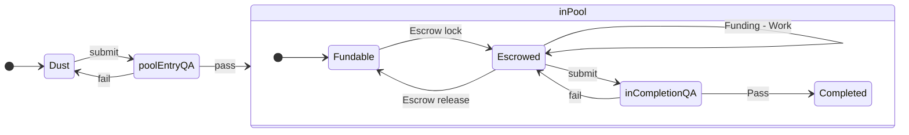

# I11 Request-Idea

## Target

[R10 Request-Idea](https://github.com/dreamcatcher-tech/dreamcatcher-tech.github.io/blob/master/website/nfas/Requests/R10.md)

## Inherits

## Dependencies

## Outputs

- [R10 Request-Idea](../Requests/R10.md)
- [I11 Request-Idea](./I11.md)
- [Request Template](../../pool/Request%20Template.md)
- [Idea Template](../../pool/Idea%20Template.md)
- [DC Pool Page](../../pool/Pool.md)
- [Pool Process](../../pool/Pool%20Process.md)

## Concept
We want to encourage Requests and Ideas to be written down, no matter how vague, as early as possible, then provide a route to move from that vagueness through to having them admitted to a Pool, executed and produce Outputs.  To do this we'd set up areas in git where md files flow through the following process:  

1. Dust: Any Request or Idea that has not been accepted by Pool QA for entry. In this state they can be as rough or as complete as you want - no-one's checking.  This is the entry area into the process.   NFTs may (optionally) be generated by the Worker at any point in this state, one per doc.
2. poolEntryQA: Being considered by the QA appointed by this pool as to whether it meets the formating/content standards that that pool has stipulated.  NFTs are required to pass QA and must be of suitable content and unique.
3. Fundable: The Request/Idea now has met the standards required by the pool, is available for Workers or Funders to contribute to in a permissionless manner but not under escrow.  A running total of the time/payments spent to date are recorded.
4. Escrowed: A contract has been negotiated between a Funder and a Worker for delivery of the all or parts of the Outputs stated in the Idea, with funds put in escrow.   A running total of the time/payments spent to date are recorded, and for any escrow payments made, the fact of that payment is also recorded.
5. inCompletionQA: The Output Asset(s) have been worked on to the extent that they can be submitted to QA to check whether the work promised in the Idea, which may have referenced a Request, has been completed.  I.e. did it do what it said it would do? 
6. Output: the Assets produced from the work are now available for use, having passed QA.  These Outputs come with the context of the Idea which kicked off the work, and (optionally) the Request which the Idea is attempting to fulfil.

When funds are escrowed they come with a lock, which allows QA to release them based on the contents of the contract, which references the Idea or part of the Idea, and whether they judge that contract to have been completed.  That lock can time out, or the worker can declare failure, or both parties agree not to proceed, at which point escrow is released back to the funder and the Idea moves back to Fundable state in the pool if there are no further ewscrows in place.

A record of these states would be maintained in a file named [Pool.md](../../pool/Pool.md) which contains a markdown grid of Requests and the Ideas in each state.  For each row we track a tally of the USD funds and the time expenditure used against each one.  This information is moved, during state changes, not duplicated.

To implement the states and state transistions, we'd use two different folders in git, and a pool dashboard ([Pool.md](../../pool/Pool.md))

1. Requests and Ideas in 'Dust' state are in the [website/nfas](../../nfas) folder.  They are not listed in [Pool.md](../../pool/Pool.md)
2. Requests and Ideas in 'Fundable' state are in the [website/pool](../../pool) folder, and linked from the Fundable grid in [Pool.md](../../pool/Pool.md)
3. Dust -> Fundable state change involves copying the file from one folder to the next, not moving it.  This way we replicate a fork.  
4. Escrowed -> Completed and Open -> Completed state changes moves the link and time/cost data to the Completed grid in [Pool.md](../../pool/Pool.md) but does not involve copying the file itself.

We'd keep the templates for Requests and Ideas in the [website/pool](../website/pool) folder, and link to them from [Pool.md](../../pool/Pool.md).  We'd publish the Request/Idea process at the bottom of [Pool.md](../../pool/Pool.md).

For implementing QA we will use a combination of youtube live streamed calls and pull requests between msm & inv.  Feedback for failed QA attempts is therefore in recorded form rather than documents.  Successful QA attempts are documented by an accepted pull request.

We do not have an attribution algo for the dispersal of any revenue that comes, should it ever come.  However, we do have two units that we can record now as to the contribution.  The two units are pomos and dollars.  The pomos and dollars are logged against the Asset that was being worked on.  We invite a Request in due course to produce a starter Attribution Algo to generate the algorithmic cap table.  

## Actors and Actions

Actors are non-exclusive; a single user can perform multiple roles.

1. QA
	1. Reviews Requests and Ideas against the formats
	1. Records feedback to workers through youtube/voice recording.
	2. Verifies NFTs generated.
1. Workers
	1. Write and implement feedback for Requests/Ideas.
	1. Submit PRs for state changes
	1. Produce the Outputs
	1. Log work data
	1. May generate NFTs for their docs.
	1. Create and edit Requests and/or Ideas.
	1. May generate NFTs at State Change
1. Funders
	1. Pool money against a Request, or an Idea in the Pool.
	1. Create and edit Requests and/or Ideas.
1. Moderator
	1. Updates [Pool.md](../../pool/Pool.md).
	1. Ensures new Requests/Ideas appear on the website.

# Integration Tests

1. Request submission:
	1. Start State:  Request not written or submitted.
    1. Worker: Write a Request using the [Request Template](../../pool/Request%20Template.md) and record it within [nfas/Requests](../../nfas/Requests). 
    1. Worker: Create NFT for the Request.
    1. Worker: Submit the Request to poolEntryQA.
    1. QA: Consider request and record feedback with failure points.
    1. Worker: Update Request based on feedback
    1. Worker: Resubmit to poolEntryQA
    1. QA: Accept request when it passes the template requirements in [Request Template](../../pool/Request%20Template.md) 
    1. Worker: Submit QA Acceptance, doc location, USD and Pomos used to date, to Moderator.
    1. Moderator: Copy Request to [pool/Requests](../../pool/Requests)
    1. Moderator: Record acceptance by updating [Pool.md](../../pool/Pool.md).
    1. End state: 
         1. Dust Request in [nfas/Requests](../../nfas/Requests)
         1. Pool Request in [pool/Requests](../../pool/Requests)
         1. [Pool.md](../../pool/Pool.md) updated with Request under 'Fundable'.
1. Idea submission:
	1. Start State:  Idea not written or submitted, Request in Pool.
    1. Worker: Write an Idea using the [Idea Template](../../pool/Idea%20Template.md), targetted at the Request in Test 1, and record it within [nfas/Ideas](../../nfas/Ideas). 
    1. Worker: Create NFT for the Idea.
    1. Worker: Submit the Idea to poolEntryQA.
    1. QA: Consider Idea and its adherence to the Request, and record feedback with failure points.
    1. Worker: Update Idea based on feedback
    1. Worker: Resubmit to poolEntryQA
    1. QA: Accept request when it passes the template requirements in [Idea Template](../../pool/Idea%20Template.md) 
    1. Worker: Submit QA Acceptance, doc location, USD and Pomos used to date, to Moderator.
    1. Moderator: Copy Request to [pool/Ideas](../../pool/Ideas)
    1. Moderator: Record acceptance by updating [Pool.md](../../pool/Pool.md).
    1. End state: 
         1. Dust Idea in [nfas/Ideas](../../nfas/Ideas)
         1. Pool Idea in [pool/Ideas](../../pool/Ideas)
         1. Fundable table in [Pool.md](../../pool/Pool.md) updated with Idea and any previous time/USD.
1. Fund the Idea:
    1. Start State: Request, with Idea that targets it, both in Pool 'Fundable.'
    1. Funder, Worker: Negotiate simple terms, agree alterations, funding level and timeout for working on the Idea.  Once agreed, record details in the Idea doc.
    1. Moderator: Move Idea link and any previous USD/time already recorded from Fundable to Escrowed in [Pool.md](../pool/Pool.md)
    1. End state: Idea moved to Escrowed table in [Pool.md](../pool/Pool.md), including previous time/USD.
1. Work on Idea Outputs while Escrowed
    1. Start State: Idea in Escrowed.
    1. Worker: Produce and update Outputs, while recording effort and the impact of that effort.
    1. End State: Idea in Escrowed, Outputs complete to the satisfaction of the Worker, time logged.
1. Complete an Idea 
    1. Start State: Idea in Escrowed, Outputs complete to the satisfaction of the Worker, time logged.
    1. Worker: Submit to inCompletionQA
    1. QA: Consider request. Check that Outputs meet the details in Idea.
    1. Worker: Update Output based on feedback
    1. Worker: Resubmit to inCompletionQA
    1. QA: Consider request, record acceptance by update of [Pool.md](../../pool/Pool.md).
    1. End Change: Escrowed -> Completed table updated in [Pool.md](../../pool/Pool.md).  Record on QA acceptance recorded in Idea.
1. Self improvement
    1. Start State: [Request Template](../../pool/Request%20Template.md), [Idea Template](../../pool/Idea%20Template.md), [DC Pool Page](../../pool/Pool.md), [Pool Process](../../pool/Pool%20Process.md) exist.  Notes from one execution of the process available.
    1. Worker: Submit an Idea for the improvement to be made (targetted at [R10 Request-Idea](../../Requests/R10.md))
    2. Worker: Run idea through to completed using current [Pool Process](../../pool/Pool%20Process.md)
    3. End State: Updated [Pool Process](../../pool/Pool%20Process.md), [Request Template](../../pool/Request%20Template.md), [Idea Template](../../pool/Idea%20Template.md), [DC Pool Page](../../pool/Pool.md) dependant on improvements.  Updated Assets have passed InCompletionQA.

Done is when the process has passed all integration tests, [The User Dictionary](../../docs/) has been updated, the complexity count (number of Dictionary concepts used) is known and one cycle of self-improvement has been proven.

## Implementation Steps
1. Draft the initial version of the process in [Pool Process](../../pool/Pool%20Process.md).
2. Draft compatible Templates at [Request Template](../../pool/Request%20Template.md), [Idea Template](../../pool/Idea%20Template.md)
3. Set the data in [Pool.md](../../pool/Pool.md) for any existing Requests/Ideas.
4. Run an initial trivial Test Request/Idea pair through the process to Completed, which involves generating Outputs and two state changes with QA at each.  Take notes on where the process is incomplete or misfires.
5. With the notes on the action of the process, submit an Idea (and optionally a Request) for improvements to the Pool. Run the improvements Request/Idea pair through the process to improve the process.  Repeat until no major changes to the core process are proposed.  (Changes to the wider, non-simple case are recorded as Dust Requests for future work.)
6. Record the complexity count for the current [The User Dictionary](../../docs/), update with all terms in this process, then recalculate the complexity count.  Record results in the [Pool Process](../../pool/Pool%20Process.md)
7. Create Dust for all existing App Concepts, then run each, one by one, through to Escrowed.

