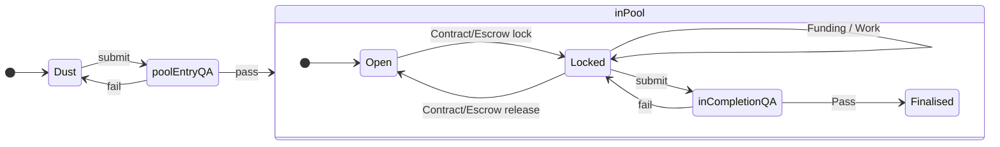

# I11 Request-Idea

## Target

[R10 Request-Idea](https://github.com/dreamcatcher-tech/dreamcatcher-tech.github.io/blob/master/website/nfas/Requests/R10.md)

## Inherits

## Dependencies

## Outputs

- [R10 Request-Idea](../Requests/R10.md)
- [I11 Request-Idea](./I11.md)
- [DC Pool Page](https://dreamcatcher-tech.github.io/pool/)
- [Pool Process and Complexity count](https://github.com/dreamcatcher-tech/dreamcatcher-tech.github.io/blob/master/website/pool/Pool%20Process.md)

## Concept
We want to encourage Requests and Ideas to be written down, not matter how vague, as early as possible, then provide a route to move from that vagueness through to having them admitted to a Pool, executed and produce Outputs.  To do this we'd set up areas in git where md files flow through the following process:  

1. Dust: Any Request or Idea that has not been accepted by Pool QA for entry. In this state they can be as rough or as complete as you want - no-one's checking.  This the is entry area into the process.   NFTs may (optionally) be generated by the author at any point in this state, one per doc.
2. poolEntryQA: Being considered by the QA appointed by this pool as to whether it meets the formating/content standards that that pool has stipulated.  NFTs are required to pass QA and must be of suitable content and unique.
3. Open: The Request/Idea now has met the standards required by the pool, is available for Workers or Funders to contribute to in a permissionless manner but not under escrow.  A running total of the time/payments spent to date are recorded.
4. Locked: A contract has been negotiated between a Funder a Worker for delivery of the all or parts of the Outputs stated in the Idea, with funds put in escrow.   A running total of the time/payments spent to date are recorded, and for any escrow payments made, the fact of that payment is also recorded.
5. inCompletionQA: The Output Asset(s) have been worked on to the extent that they can be submitted to QA to check whether the work promised in the Idea, which may have referenced a Request, has been completed.  I.e. did it do what it said it would do? 
6. Output: the Assets produced from the work are now available for use, having passed QA.  These Outputs come with the context of the Idea which kicked off the work, and (optionally) the Request which the Idea is attempting to fulfil.

When the lock times out, or the workers declare failure, or both parties agree, escrow is released back to the funder and the Idea moves back to Open state in the pool

A record of these states would be maintained in a file named [Pool.md](https://github.com/dreamcatcher-tech/dreamcatcher-tech.github.io/blob/master/website/pool/Pool.md) which contains a markdown grid of Requests and the Ideas in each state.  For each row we track a tally of the USD funds and the time expenditure used against each one.  This information is moved, during state changes, not duplicated.

To implement the states and state transistions, we'd use two different folders in git, and a pool dashboard ([Pool.md](https://github.com/dreamcatcher-tech/dreamcatcher-tech.github.io/blob/master/website/pool/Pool.md))

1. Requests and Ideas in 'Dust' state are in the [website/nfas](https://github.com/dreamcatcher-tech/dreamcatcher-tech.github.io/tree/master/website/nfas) folder.  They are not listed in [Pool.md](https://github.com/dreamcatcher-tech/dreamcatcher-tech.github.io/blob/master/website/pool/Pool.md)
2. Requests and Ideas in 'Open' state are in the [website/pool](https://github.com/dreamcatcher-tech/dreamcatcher-tech.github.io/tree/master/website/pool) folder, and linked from the Open grid in [Pool.md](https://github.com/dreamcatcher-tech/dreamcatcher-tech.github.io/blob/master/website/pool/Pool.md)
3. Dust -> Open and Open -> inProgress state change involves copying the file from one folder to the next, not moving it.  This way we replicate a fork.  The time/cost data grid in [Pool.md](https://github.com/dreamcatcher-tech/dreamcatcher-tech.github.io/blob/master/website/pool/Pool.md)
4. inProgress -> Finalised state change moves the link and time/cost data to the Finalised grid in [Pool.md](https://github.com/dreamcatcher-tech/dreamcatcher-tech.github.io/blob/master/website/pool/Pool.md)

We'd keep the templates for Requests and Ideas in the website/AppData folder, and link to them from [Pool.md](https://github.com/dreamcatcher-tech/dreamcatcher-tech.github.io/blob/master/website/pool/Pool.md).  We'd publish the Request/Idea process at the bottom of [Pool.md](https://github.com/dreamcatcher-tech/dreamcatcher-tech.github.io/blob/master/website/pool/Pool.md).

For implementing QA we will use a combination of youtube live streamed calls and pull requests between msm & inv.  Feedback for failed QA attempts is therefore in recorded form rather than documents.  Successful QA attempts are documented by an accepted pull request.

We do not have an attribution algo for the dispersal of any revenue that comes, should it ever come.  However, we do have two units that we can record now as to the contribution.  The two units are pomos and dollars.  The pomos and dollars are logged against the Asset that was being worked on.  We invite a Request in due course to produce a starter Attribution Algo to generate the algorithmic cap table.  

## Actors and Actions

Actors are non-exclusive; a single user can perform multiple roles.

1. QA
	1. Reviews Requests and Ideas against the formats
	1. Records feedback to workers through youtube/voice recording.
	2. Verifies NFTs generated.
1. Workers
	1. Write and implement feedback for Requests/Ideas.
	1. Submit PRs for state changes
	1. Produce the Outputs
	1. Log work data
	1. May generate NFTs for their docs.
	1. Create and edit Requests and/or Ideas.
	1. May generate NFTs at State Change
1. Funders
	1. Pool money against a Request, or an Idea in the Pool.
	1. Create and edit Requests and/or Ideas.
	1. May generate NFTs at State Change
1. Moderator
	1. Updates [Pool.md](https://github.com/dreamcatcher-tech/dreamcatcher-tech.github.io/blob/master/website/pool/Pool.md).
	1. Ensures new Requests/Ideas appear on the website.
	1. Receive PRs for state changes, and executes merge on advice from QA.

## Implementation Steps
1. Draft the guidance section in [Pool.md](https://github.com/dreamcatcher-tech/dreamcatcher-tech.github.io/blob/master/website/pool/Pool.md) and Templates.
1. Populate the data in [Pool.md](https://github.com/dreamcatcher-tech/dreamcatcher-tech.github.io/blob/master/website/pool/Pool.md) for any existing Requests/Ideas.
1. Run the integration tests 1-4 on a Test Request/Idea pair.  This pair will be trivial - we need to test through to Finalised, which involves generating Outputs and two state changes with QA at each, so we will keep it light in order to focus on the integration tests themselves.  
1. Check/update that [The User Dictionary](https://dreamcatcher-tech.github.io/docs/) is correct for the terms used.  
2. Run Integration test 5 (Self Improvement) on the notes generated on the process to this point.
3. Create Dust for all existing App Concepts, then run each, one by one, through to Locked.

# Integration Tests

These integration tests are intended 

1. Request submission:
    1. Author: Write a Request and records it in Drafts. 
    1. Author: Submit the Request to poolEntryQA
    1. QA: Consider request. Have it bounce with QA feedback in audio or video.  
    1. Author: Update Request based on feedback
    1. Author: Resubmit to poolEntryQA
    1. QA: Consider request, record acceptance by update of [Pool.md](https://github.com/dreamcatcher-tech/dreamcatcher-tech.github.io/blob/master/website/pool/Pool.md).
    1. State Change: Dust -> Open, folders updated, [Pool.md](https://github.com/dreamcatcher-tech/dreamcatcher-tech.github.io/blob/master/website/pool/Pool.md) updated, Request passes guidance and template checks.
1. Idea Submission targetted at Request
	1. As above steps.
	1. QA: Consider Request/Idea lock in each poolEntryQA submission.
1. Work on Idea Outputs while Locked
    1. Worker: Produce and update Outputs, while recording effort and the impact of that effort.
    1. Funder: Contribute and distribute money, while recording contribution and the impact of that investment.
1. Finalise an Idea 
	1. Worker: Submit to inCompletionQA
    1. QA: Consider request. Have it bounce with QA feedback in audio or video.  
    1. Worker: Update Output based on feedback
    1. Worker: Resubmit to inCompletionQA
    1. QA: Consider request, record acceptance by update of [Pool.md](https://github.com/dreamcatcher-tech/dreamcatcher-tech.github.io/blob/master/website/pool/Pool.md).
    1. State Change: Locked -> Finalised, folders updated, [Pool.md](https://github.com/dreamcatcher-tech/dreamcatcher-tech.github.io/blob/master/website/pool/Pool.md) updated.
1. Self improvement
	1. Architects: For notes taken on the Open -> Finalised process
	    1. Submit an Idea for the improvement to be made (targetted at [R10 Request-Idea](../Requests/R10.md))
		1. Submit to State Change Open -> Locked QA
		1. Pass QA, and update folders and [Pool.md](https://github.com/dreamcatcher-tech/dreamcatcher-tech.github.io/blob/master/website/pool/Pool.md)
		1. Carry out the improvement, logging time.
		1. Submit to State Change Locked -> Finalised QA
		1. Pass QA, and update folders and [Pool.md](https://github.com/dreamcatcher-tech/dreamcatcher-tech.github.io/blob/master/website/pool/Pool.md)

Done is when the process has passed all three integration tests, [The User Dictionary](https://dreamcatcher-tech.github.io/docs/) has been updated, the complexity count (number of Dictionary concepts used) is known and one cycle of self-improvement has been proven.

