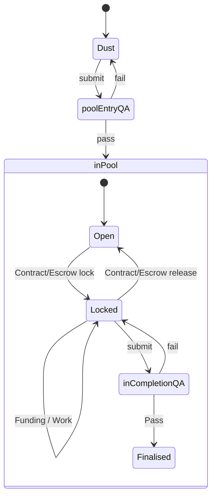

# Pool Process

## Target

[I11 Request-Idea](../dust/Ideas/I11)

## Inherits

[User Dictionary](../docs/User Dictionary)

## Dependencies

## License

This Process is offered for further use and alteration under the [Core DPL](../docs/DPL/Core DPL)

# Preface

This is a process which takes Requests and Ideas from Dust through to having been completed with Outputs.

It's currently in use by [Pool.md](.) and forms part of the QA Guidance for that pool, along with the templates for

For further reading on the background for this process, please see [Background for The Pool Process](../blog/drafts/Background Pool Process)

For the templates referenced below see:

1. [Request Template](../pool/Request Template)
1. [Idea Template](../pool/Idea Template)

## Process

# Process Diagram Definitions

1. Dust: Any Request or Idea that has not been accepted by Pool QA for entry. In this state they can be as rough or as complete as you want - no-one's checking. This the is entry area into the process. NFTs may (optionally) be generated by the author at any point in this state, one per doc.
2. poolEntryQA: Being considered by the QA appointed by this pool as to whether it meets the formating/content standards that that pool has stipulated. NFTs are required to pass QA and must be of suitable content and unique.
3. Open: The Request/Idea now has met the standards required by the pool, is available for Workers or Funders to contribute to in a permissionless manner but not under escrow. A running total of the time/payments spent to date are recorded.
4. Locked: A contract has been negotiated between a Funder a Worker for delivery of the all or parts of the Outputs stated in the Idea, with funds put in escrow. A running total of the time/payments spent to date are recorded, and for any escrow payments made, the fact of that payment is also recorded.
5. inCompletionQA: The Output Asset(s) have been worked on to the extent that they can be submitted to QA to check whether the work promised in the Idea, which may have referenced a Request, has been completed. I.e. did it do what it said it would do?
6. Finalised: the Outputs produced from the work are now available for use, having passed QA. These Outputs come with the context of the Idea which kicked off the work, and (optionally) the Request which the Idea is attempting to fulfil.

# Process Description

To implement the states and state transistions two different folders are used in git.

1. Requests and Ideas in 'Dust' state are in the [website/dust](../dust) folder. They are not listed in [Pool.md](../pool)
2. Requests and Ideas in 'Open' state are in the [website/pool](.) folder, and linked from the Open grid in [Pool.md](.)
3. Dust -> Open state change involves copying the file from one folder to the next, not moving it. This way we replicate a fork. The time/cost data grid in [Pool.md](.)
4. Locked -> Finalised state change moves the link and time/cost data to the Finalised grid in [Pool.md](.)

In order to pass the Dust -> Open state change, Requests and Ideas will be checked by QA against the templates for [Requests](../pool/Request Template) and [Ideas](../pool/Idea Template).

A Request/Idea pair, or a solo Idea, can pass from either from Open or Locked -> Finalised by passing QA, which will judge whether what was described in the Idea has been completed, and for Request/Ideas, whether or to which extent the end execution has held to the original Strategic and Tactical Intents in the Requst.

Ideas that are inside of the Pool (either Open or Locked) are available for funding by pool members.

A record of the states of all Requests/Ideas are maintained in the pool dashboard - [Pool.md](.) which contains a markdown grid of Requests and the Ideas in each state. For each row we track a tally of the USD funds and the time expenditure used against each one. This information is moved, during state changes, not duplicated.

All work carried out on Requests/Ideas inside the pool must track their time in pomos, being a 25 min segment of time. Logging of these can be outside of the pool, but evidence must be provided to QA in the form of a time log when applying for Finalised.

Funding for Locked Request/Ideas are required to have a contract, which includes the [Core DPL](../docs/DPL/Core DPL). The Escrow Service used is TBD.

When the lock times out, or the workers declare failure, or both parties agree, escrow is released back to the funder and the Idea moves back to Open state in the pool

When Request/Idea/Output is submitted to QA for acceptance as Finalised, QA may give feedback if the work carried out does not meet the standard stated in the Idea, or may sign off and allow it to be moved to Finalised, at which point escrow funds are automatically issued.

QA we will use a combination of youtube live streamed calls and pull requests to provide feedback. Feedback for failed QA attempts is therefore in recorded form rather than documents. Successful QA attempts are documented by an accepted pull request.

# Complexity Count

1. Baseline complexity before this process: XX
2. Complexity after thjs process: XX
